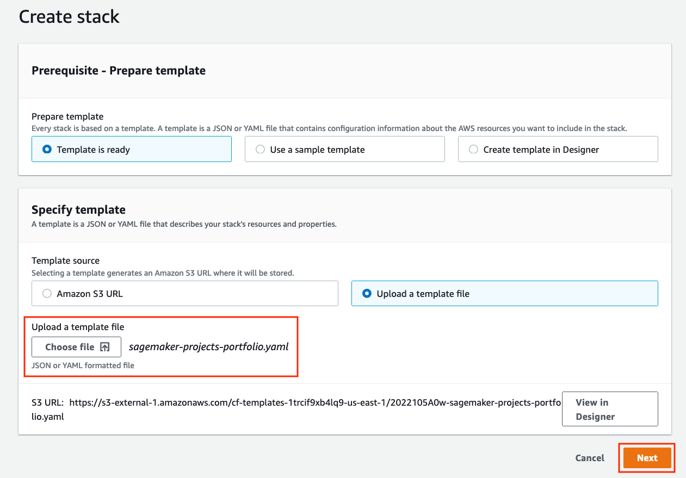
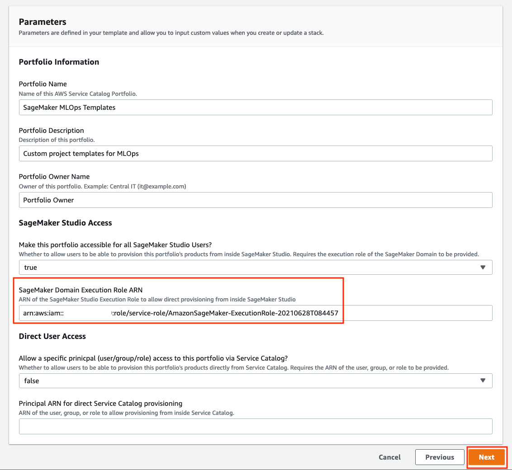

# Custom Project Templates in SageMaker

This repository contains an example SageMaker Project template. Each folder in this repo contains a custom project template with details on what that template achieves and how to set it up. The generic instructions are shown below.

## Custom Projects
* [MLOps template for model training and deployment with GitLab and GitLab Pipelines](../../tree/main/mlops-template-gitlab)
* [MLOps template for model training and deployment using encrypted buckets](../../tree/main/encrypted-buckets)
* [MLOps template for model training and deployment using multiple repo branches](../../tree/main/multi-branch-mlops-train)
* [Asynchronous Inference Endpoint Deployment Pipeline](../../tree/main/asynchronous-inference-endpoint)
* [Batch Inference Endpoint Deployment Pipeline](../../tree/main/batch-inference)
* [Multi Model Endpoint Deployment Pipeline](../../tree/main/multi-model-endpoint)
* [Amazon SageMaker Project with Terraform and GitHub](../../tree/main/sm-project-tf-github)
* [Amazon SageMaker Project with Terraform and GitLab](../../tree/main/sm-project-tf-gitlab)

## Adding the templates to SageMaker Studio Studio
In order to add your custom SageMaker Projects into SageMaker studio and deploy them, you will need to complete 3 steps:

### Step 1: Create a Service Catalog Portfolio (only needs to be done the first time)

1. Download the __sagemaker-projects-portfolio.yaml__ CloudFormation template from the root of this repo to your local machine.
1. Open the CloudFormation console at https://console.aws.amazon.com/cloudformation
1. Choose on __Create stack__, then __With new resources (standard)__.
1. On the Create Stack screen, under __Template source__, choose __Upload a template file__.
1. Choose __Choose file__ then select the __sagemaker-projects-portfolio.yaml__ from your machine.
1. Choose __Next__

    

1. On the __Parameters__ screen, under __Stack Name__, enter a unique name for this CloudFormation stack.

1. Next, you will need to enter either your SageMaker Domain Execution Role, or the Role that your Studio users are assuming if you have defined a custom one. You can find your SageMaker Domain Execution Role ARN in the Studio Dashboard: https://console.aws.amazon.com/sagemaker/home?#/studio under the __Domain__ section, then __Execution Role__. Paste that value into the __SageMaker Domain Execution Role ARN__ parameter.

1. Choose __Next__.

    

1. On the __Configure stack options__ screen, no changes are necessary. Scroll to the bottom and choose __Next__.

1. On the __Review__ screen, scroll to the bottom and choose __Create Stack__.

1. After a few seconds, the stack should move to a __CREATE_COMPLETE__ stage, and will be ready to add products into.

### Step 2: Add your SageMaker Projects product to the portfolio

1. In the project you wish to use in SageMaker studio, download the product CloudFormation template to your machine. There is a unique one in each project, and the filename ends in "-product.yaml"

1. Similar to the way you created the portfolio, open the CloudFormation console at https://console.aws.amazon.com/cloudformation, upload that template, fill in the necessary parameters, and create the stack. Each project may have different parameters, which will be outlined in their README.md files. 

    Every template will require your Service Catalog portfolio id, which can be found in the __Outputs__ tab of your deployed portfolio stack or in the Service Catalog portfolio list: https://console.aws.amazon.com/servicecatalog/home?#/portfolios

1. Once your product stack is in a __CREATE_COMPLETE__ stage, you can then go to SageMaker Studio for deployment.

### Step 3: Deploy your SageMaker Projects project template

1. Open SageMaker Studio and sign in to your user profile.
1. Choose the SageMaker __components and registries__ icon on the left, and choose the __Create project__ button.
1. The default view displays SageMaker templates. Switch to the __Organization__ templates tab to see custom project templates.
1. The template you created will be displayed in the template list. (If you do not see it yet, make sure the correct execution role is added to the product and the __sagemaker:studio-visibility__ tag with a value of __true__ is added to the Service Catalog product).
1. Choose the template and click Select project template.

    

1. Enter a name and optional description for the project. If additional parameters or tags are required, enter the appropriate values, and choose Create project.

You have now successfully created an MLOps template and a SageMaker Project using the custom template. Refer to `encrypted-buckets` for a sample implementation. 