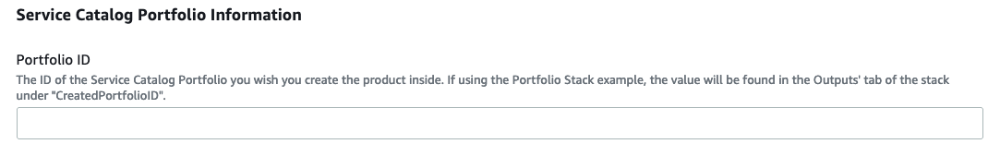

# API Gateway and Serverless Inference Endpoint Deployment Pipeline

## Purpose

Use this template to automate the deployment of models in the Amazon SageMaker model registry to SageMaker Serverlss Endpoints with a API Gateway for real-time inference. The template provisions an AWS CodeCommit repository with configuration files to specify the model deployment steps, CloudFormation templates to define endpoints as infrastructure, and seed code for testing the endpoint. You can customize the template to suit your requirements or add more tests. AWS CodePipeline is used to orchestrate the model deployment. Model building pipeline: None Code repository: AWS CodeCommit Orchestration: AWS CodePipeline

This project is derived from the built-in [MLOps template for model deployment](https://docs.aws.amazon.com/sagemaker/latest/dg/sagemaker-projects-templates-sm.html#sagemaker-projects-templates-code-commit) but uses serverless inference endpoints.

## Architecture

## Instructions

Part 1: Create initial Service Catalog Product

1. To create the Service Catalog product for this project, download the `create-api-gateway-serverless-product.yaml` and upload it into your CloudFormation console: https://console.aws.amazon.com/cloudformation/home?#/stacks/create/template

2. Update the Parameters section:

    - Supply a unique name for the stack

        

    - Enter your Service Catalog portfolio id, which can be found in the __Outputs__ tab of your deployed portfolio stack or in the Service Catalog portfolio list: https://console.aws.amazon.com/servicecatalog/home?#/portfolios

        

    - Update the Product Information. The product name and description are visible inside of SageMaker Studio. Other fields are visible to users that consume this directly through Service Catalog. 

    - Support information is not available inside of SageMaker Studio, but is available in the Service Catalog Dashboard.

    - Updating the source code repository information is only necessary if you forked this repo and modified it.

3. Choose __Next__, __Next__ again, check the box acknowledging that the template will create IAM resources, and then choose __Create Stack__.

4. Your template should now be visible inside of SageMaker Studio.

Part 2: Deploy the Project inside of SageMaker Studio

1. Open SageMaker Studio and sign in to your user profile.

1. Choose the SageMaker __components and registries__ icon on the left, and choose the __Create project__ button.

1. The default view displays SageMaker templates. Switch to the __Organization__ templates tab to see custom project templates.

1. The template you created will be displayed in the template list. (If you do not see it yet, make sure the correct execution role is added to the product and the __sagemaker:studio-visibility__ tag with a value of __true__ is added to the Service Catalog product).

1. Choose the template and click Select the correct project template.

    

6. Fill out the required fields for this project.

    - __Name:__ A unique name for the project deployment.

    - __Description:__ Project description for this deployment.
    
    - __UseRoleArn:__ The ARN of the IAM Role which is used by the CodePipeline. The template will create a default role for you which is based on the SageMaker-provided template, but has extra permisions to create and manage API Gateway resources. Change this only if you need to customize the IAM Role policy.
    
    - __SourceModelpackageGroupname__: The SageMaker model registry model packag group that you want to deploy with this pipeline template.
    

7. Choose __Create Project__.

    

8. After a few minutes, your example project should be deployed and ready to use.