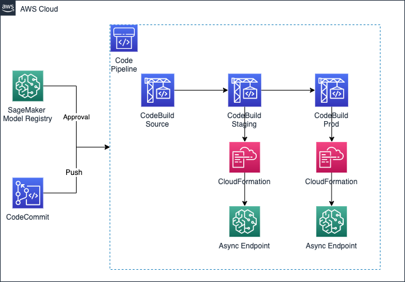

# Asynchronous Inference Endpoint Deployment Pipeline

## Purpose

The purpose of this template is to deploy an asynchronous inference endpoint, given a `ModelGroupPackageName` from the Amazon SageMaker Model Registry. 

## Architecture

## Instructions

1. Run `sh init.sh <AWS-BUCKET>`
2. Create a Product in Service Catalog using the `template.yml` file as CFN and add the Product to the Portfolio
3. Set the `sagemaker:studio-visibility` tag to `true` in the Product
4. Launch in the SageMaker Projects Organization Templates page