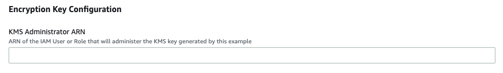
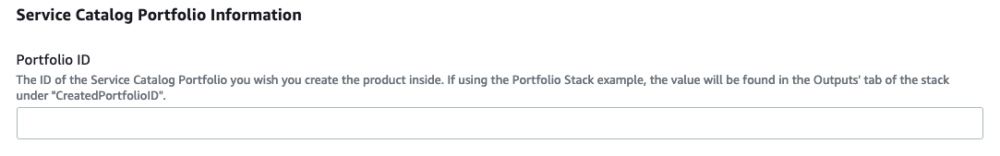
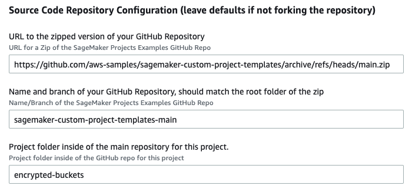
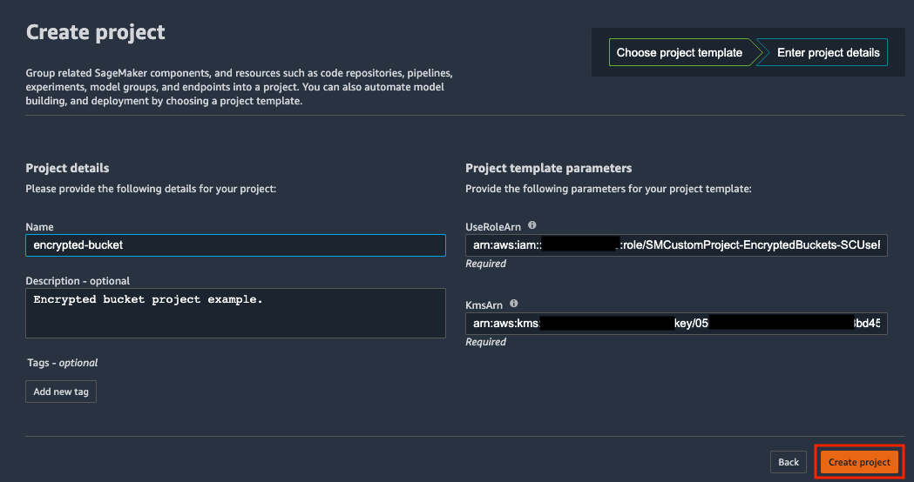

## Template Description

The sample template `MLOps-template-example.yml` was created using the first-party MLOps template for model building, training and deployment. The template is updated to have security best practices, i.e., encryption and versioning for S3 buckets. The template also requires the user to provide a customer managed key on KMS for bucket encryption, and uses custom roles as launch constraints for deploying the template with least-privilege permissions.

The attached IAM role for Catalog Use also enforces tagging for models and training jobs created as well, by explicity denying creation of jobs without corresponding tags. To execute the seed pipeline after the project is created, add tags to the ProcessingStep, TrainingStep etc. of `pipeline.py`. For SageMaker Pipelines SDK, see [SageMaker Pipelines](https://sagemaker.readthedocs.io/en/stable/workflows/pipelines/index.html).

"Project Name" parameter for this template requires a "custom-project" suffix to the provided name using the AllowedPattern property. This allows us to restrict access only to specific resources in all services, for example, update only CodePipeline workflows with a 'custom-project' suffix. In a multi-team development environment, this allows for resource isolation.

## Instructions

Part 1: Create initial Service Catalog Product

1. To create the Service Catalog product for this project, download the `create-async-endpoint-product.yaml` and upload it into your CloudFormation console: https://console.aws.amazon.com/cloudformation

2. Update the Parameters section:

    - Supply a unique name for the stack

        

    - As part of this example, the template will automatically create a customer managed KMS key that you can use to encrypt your S3 bucket. In the __KMS Administrator ARN__ parameter, enter the ARN of the IAM role or user that will administer the KMS key. To look up this value you can go to the IAM console: https://console.aws.amazon.com/iam/home and copy the ARN for the respective user or role.

        

    - Enter your Service Catalog portfolio id, which can be found in the __Outputs__ tab of your deployed portfolio stack or in the Service Catalog portfolio list: https://console.aws.amazon.com/servicecatalog/home?#/portfolios

        

    - Update the Product Information. The product name and description are visible inside of SageMaker Studio. Other fields are visible to users that consume this directly through Service Catalog.

    - Support information is not available inside of SageMaker Studio, but is available in the Service Catalog Dashboard.

    - Updating the source code repository information is only necessary if you forked this repo and modified it.

        

3. Choose __Next__, __Next__ again, check the box acknowledging that the template will create IAM resources, and then choose __Create Stack__.

4. Your template should now be visible inside of SageMaker Studio.

Part 2: Deploy the Project inside of SageMaker Studio

1. Open SageMaker Studio and sign in to your user profile.

1. Choose the SageMaker __components and registries__ icon on the left, and choose the __Create project__ button.

1. The default view displays SageMaker templates. Switch to the __Organization__ templates tab to see custom project templates.

1. The template you created will be displayed in the template list. (If you do not see it yet, make sure the correct execution role is added to the product and the __sagemaker:studio-visibility__ tag with a value of __true__ is added to the Service Catalog product).

1. Choose the template and click Select the correct project template.

    

6. Fill out the required fields for this project.

    - __Name:__ A unique name for the project deployment.

    - __Description:__ Project description for this deployment.

    - __UseRoleARN:__ IAM Role created by the project to use the project.

    - __KmsArn:__ ARN of the KMS Key being used to encrypt your bucket.

7. Choose __Create Project__.

    

8. After a few minutes, your example project should be deployed and ready to use.

### Appendix: Resources created

The SageMaker project creates the following AWS resources:
- S3 Bucket to store artifacts
- CodePipeline workflow for model building, including - 
    - CodeCommit repository
    - CodeBuild project to execute a SageMaker pipeline
- CodePipeline workflow for model deployment, including
    - CodeCommit repository
    - CodeBuild project to create configuration files for deployment
    - CodeBuild projects to deploy Staging and Prod resources through CloudFormation
    - Test Staging endpoint
    - Manual approval step from Staging to Prod
- EventBridge rules to trigger the pipelines

In addition, the seed code provided creates the following set up within the Project:
- Two repositories for model building and deployment
- A fully executable SageMaker pipeline with code and a sample Jupyter notebook
- Model package groups in SageMaker Model Registry, associated with this project
- Staging endpoint once the pipeline executes successfully. 
_Note: On project creation, the pipeline will automatically execute._
