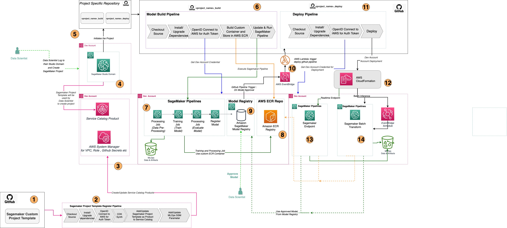
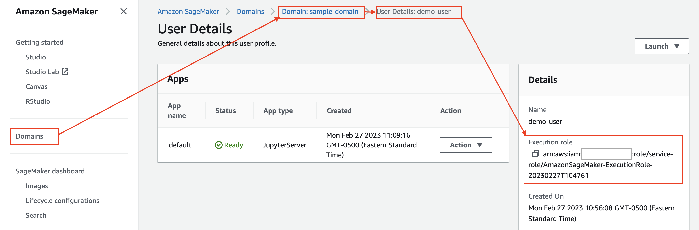
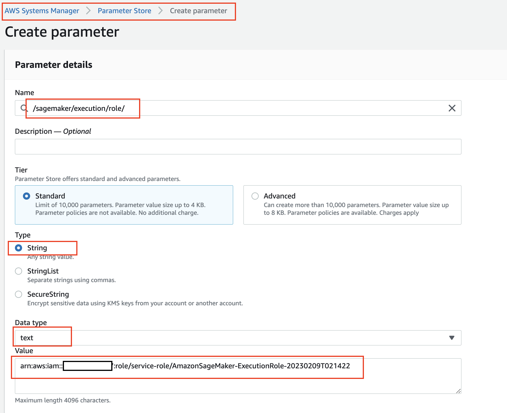
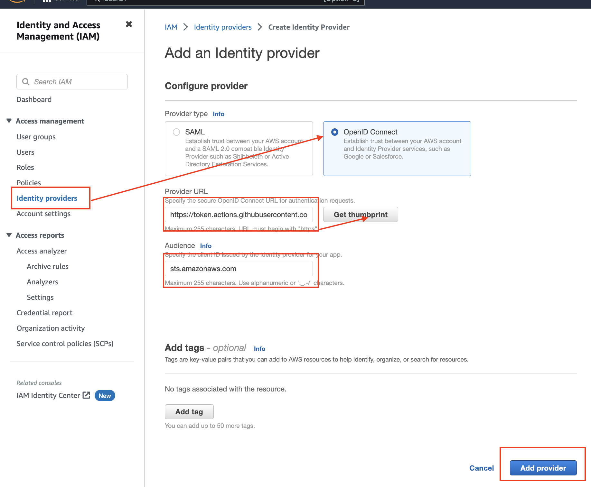
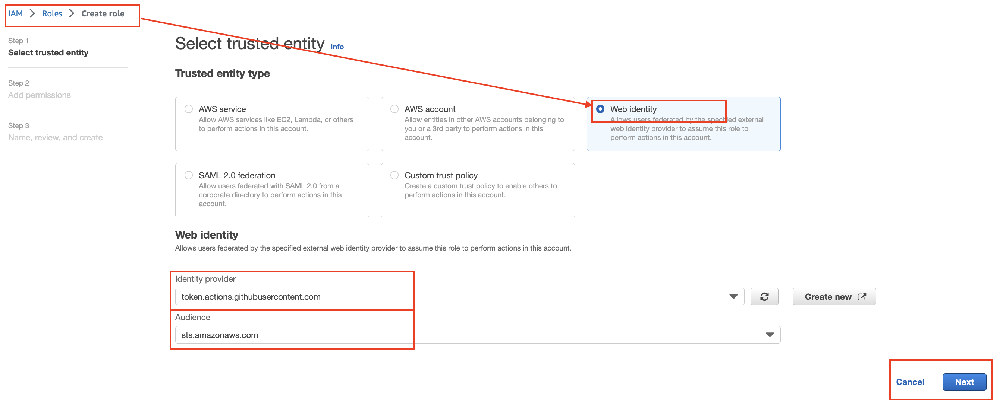
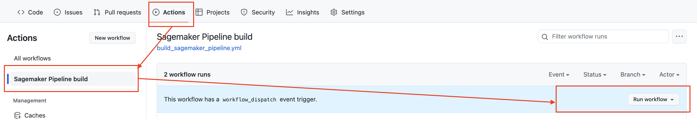
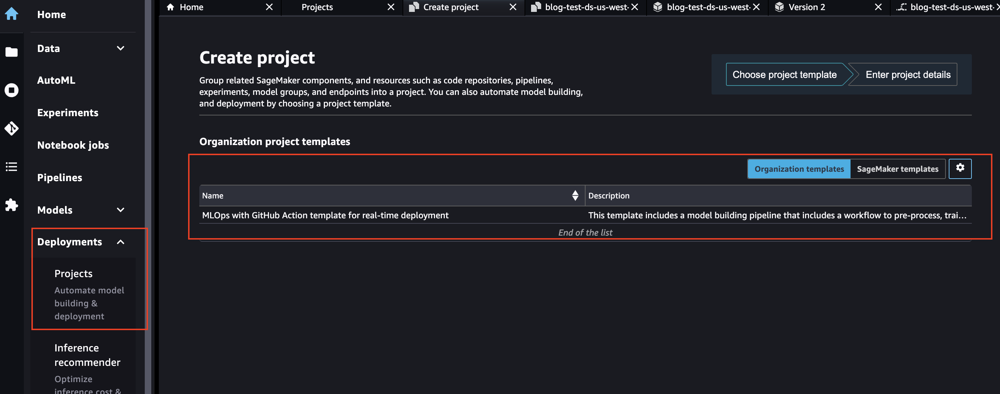
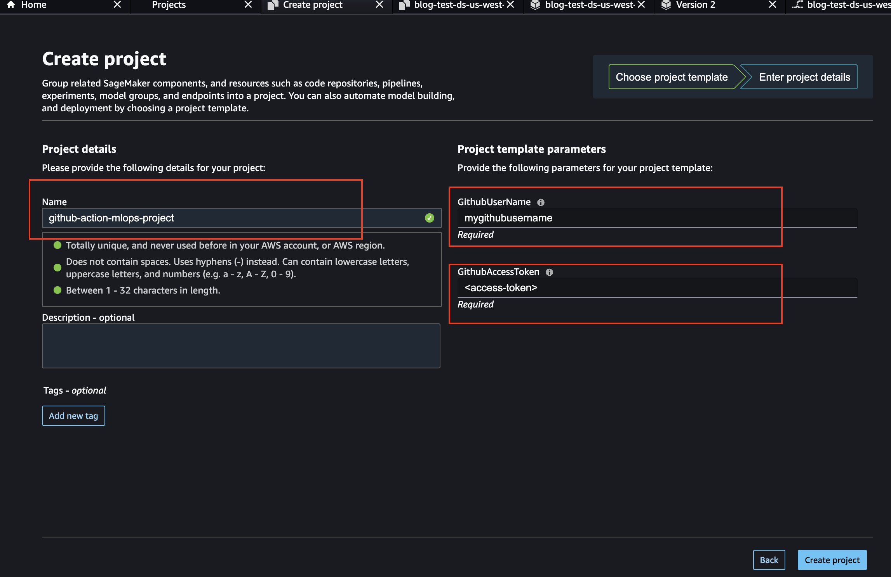

# MLOps SageMaker Project Template for GitHub Actions

This repository contains resources required to deploy an MLOps SageMaker Project Template using GitHub Actions for CI/CD.

## Table of Contents

- [MLOps SageMaker Project Template for GitHub Actions](#mlops-sagemaker-project-template-for-github-actions)
  - [Table of Contents](#table-of-contents)
  - [Solution Architecture](#solution-architecture)
  - [Repository Structure](#repository-structure)
  - [Deployment Options](#deployment-options)
    - [CI/CD Deployment of Service Catalog Stack](#cicd-deployment-of-service-catalog-stack)
    - [Manual Deployment of Service Catalog Stack](#manual-deployment-of-service-catalog-stack)
      - [Pre-requisites](#pre-requisites)
      - [Project Build and Deploy](#project-build-and-deploy)
  - [See what's deployed](#see-whats-deployed)
  - [Clean-up](#clean-up)
  - [Troubleshooting](#troubleshooting)

## Solution Architecture



## Repository Structure

```
.
├── LICENSE.txt
├── Makefile
├── README.md
├── app.py
├── cdk.json
├── diagrams
├── .github <--- contains the GitHub Action WorkFlow script
│   ├── sm_template_register_service_catalog.yml
├── mlops_sm_project_template
│   ├── README.md
│   ├── init.py
│   ├── cdk_helper_scripts
│   ├── config
│   │   └── constants.py <--- global configs to be used in CDK stacks
│   ├── core_stage.py <--- entry to build the different stacks
│   ├── service_catalog_stack.py <--- stack for service catalog setup and template deployment
│   └── templates
│   ├── basic_project_stack.py <--- stack for basic sagemaker project template setup - DEV Accounts provided in constants.py
│   └── pipeline_constructs
│   ├── build_pipeline_construct.py <--- construct containing CI/CD pipeline linked to the build app
│   └── deploy_pipeline_construct.py <--- construct containing CI/CD pipeline linked to the deploy app
├── requirements-dev.txt
├── requirements.txt <--- cdk packages used in the stacks (must be installed)
├── scripts <--- shell scripts to automate part of the deployments
│   └── install-prerequisites-brew.sh
└── seed_code <--- code samples to be used to setup the build and deploy repositories of the sagemaker project
   ├── build_app
   └── deploy_app
```

## Deployment Options

There are two deployment options for the SageMaker Project Template to the Service Catalog in the target account:

- **[CI/CD Deployment of Service Catalog Stack](#cicd-deployment-of-service-catalog-stack)** - Deploy by using GitHub Action CI/CD pipeline by cloning the repository to your GitHub Repository.
- **[Manual Deployment of Service Catalog Stack](#manual-deployment-of-service-catalog-stack)** - Deploy directly to the targeted accounts using CDK commands from your local development setup.

### CI/CD Deployment of Service Catalog Stack

Register the SageMaker Project Template through the GitHub Action Pipeline CI/CD (preferred method).

Follow these steps:

1. **Create a GitHub repository** with the content of this folder.
   1. Fork the repo.
   2. Clone the repo to your local machine.
   3. `cd` into the repo folder and then into the `mlops-cdk-github-action` folder.
   4. Run `git init` in the `mlops-cdk-github-action` folder.
   5. Before pushing the repo to your GitHub account, make sure the Personal Access Token you're using has both the `repo` and `workflow` scopes. This is required for the GitHub
 Action to be able to trigger the workflow.
2. Set up the SageMaker domain and user profile if you haven’t already. Follow the steps to create a SageMaker Domain: [Create SageMaker Domain](https://docs.aws.amazon.com/sagemaker/latest/dg/onboard-quick-start.html).
3. Once the domain is created, navigate to Domain, click on your Domain, click on User Profile, and copy the “Execution Role” from the right-hand side pane.

4. Update the Execution role to have the following SageMaker project IAM permissions:
    ```commandline
   {
     "Version": "2012-10-17",
     "Statement": [
         {
             "Sid": "VisualEditor0",
             "Effect": "Allow",
             "Action": [
                 "sagemaker:DescribeProject",
                 "sagemaker:CreateProject",
                 "sagemaker:DeleteProject",
                 "sagemaker:ListProjects",
                 "sagemaker:UpdateProject"
             ],
             "Resource": "*"
         }
     ]
   }
    ```
5. Go to AWS Systems Manager, navigate to the Parameter Store, and create a String Parameter of Data Type text named “/sagemaker/execution/role”. Provide the value as the SageMaker Execution Role ARN.



6. Create an IAM OpenID Connect (OIDC) identity provider. Follow the steps outlined in [AWS Documentation](https://docs.aws.amazon.com/IAM/latest/UserGuide/id_roles_providers_create_oidc.html#manage-oidc-provider-console) to create an IAM OIDC identity provider. In the Provider URL field enter `https://token.actions.githubusercontent.com`, and click Get Thumbprint. In the Audience filed, enter `sts.amazonaws.com`



7. Create an IAM role using the OIDC identity provider. OIDC allows your GitHub Actions workflows to access resources in Amazon Web Services (AWS) without storing the AWS credentials as long-lived GitHub secrets. [Learn more](https://docs.github.com/en/actions/deployment/security-hardening-your-deployments/configuring-openid-connect-in-amazon-web-services).



Assign the following permissions to this role (_Note: For setup, broad permissions are provided for these services. Later, trim down the permissions to only required ones_):
```
    AmazonEC2ContainerRegistryFullAccess
    AmazonS3FullAccess
    AWSServiceCatalogAdminFullAccess
    AWSCloudFormationFullAccess
    IAMFullAccess
    AmazonSageMakerFullAccess
    AmazonSSMFullAccess
```
Create the role with any name, such as "mlops-cdk-github-action". After creation, open the newly created role and update the Trust Relationship with your AWS account and GitHub repo details:
    
```
{
        "Version": "2012-10-17",
        "Statement": [
            {
                "Effect": "Allow",
                "Principal": {
                    "Federated": "arn:aws:iam::<your_aws_account_id>:oidc-provider/token.actions.githubusercontent.com"
                },
                "Action": "sts:AssumeRoleWithWebIdentity",
                "Condition": {
                    "StringEquals": {
                        "token.actions.githubusercontent.com:aud": "sts.amazonaws.com"
                    },
                    "StringLike": {
                        "token.actions.githubusercontent.com:sub": "repo:<github_user_name_casesensetive>/<newly_created_github_repo_name>:*"
                    }
                }
            }
        ]
    }
```
   
8. Create GitHub secrets:
  - GitHub Secrets are encrypted variables that can be created within your GitHub organization or repository. These secrets can then be used in your GitHub Actions workflows.
  - In order to run your GitHub Actions pipelines successfully, you must create the following three required secrets in your cloned repository:
    - `AWS_ACCOUNT_OPENID_IAM_ROLE` - The ARN of the IAM role created in the previous step.
    - `AWS_REGION` - The AWS region where you will be deploying the SageMaker Project Template.
    - `AWS_ACCOUNT` - The AWS account where you will be deploying the SageMaker Project Template.
   
9. In the cloned repository, you will see the "Sagemaker Project Template Registration in Service Catalog" workflow in your GitHub Actions. Run this workflow to deploy the SageMaker organizational template to AWS Service Catalog.



10. Ensure that the GitHub workflow completes successfully.

11. Launch the SageMaker Project.
  - In SageMaker Studio, *with the same SageMaker user profile as you used in the earlier steps*, go to left hand menu bar and select the "SageMaker resources" icon, which looks like a triangle.
  - Select Projects from the SageMaker resources.
  - Toggle the templates buttons to "Organization templates".
  - Select the "MLOps with GitHub Action template..."



  - Click the orange "Create project" button
  - Complete the project details
    - (e.g., "github-actions-mlops-project" for "Name")
    - Your GitHub user name (case-sensitive)
    - A [GitHub Personal access token (classic)](https://docs.github.com/en/enterprise-server@3.4/authentication/keeping-your-account-and-data-secure/creating-a-personal-access-token) with at least `repo`, `workflow`, and `delete_repo` scopes.



  - Click "Create project" to finalize the process.


### Manual Deployment of Service Catalog Stack
Manually register the SageMaker Project Template from local development.

#### Pre-requisites

* For Mac machines with [Homebrew](https://brew.sh/) installed, use `scripts/install-prerequisites-brew.sh` to install prerequisites and set up the Python environment.

1. This AWS CDK project is written in Python 3.8. Ensure you have the following installed on your workstation (preferably a Linux OS to avoid path issues) before deploying this project:

   * [Node.js](https://nodejs.org/)
   * [Python3.8](https://www.python.org/downloads/release/python-380/) or [Miniconda](https://docs.conda.io/en/latest/miniconda.html)
   * [AWS CDK v2](https://aws.amazon.com/cdk/)
   * [AWS CLI](https://aws.amazon.com/cli/)
   * [Docker](https://docs.docker.com/desktop/)

2. Create a simple method to interact with multiple AWS credentials. We recommend creating an AWS profile for each account with sufficient permissions to deploy to CloudFormation by following the instructions [here](https://docs.aws.amazon.com/toolkit-for-visual-studio/latest/user-guide/keys-profiles-credentials.html#adding-a-profile-to-the-aws-credentials-profile-file). For example, the `.aws/credentials` should look like:

    ```
    [mlops-dev]
    aws_access_key_id = YOUR_ACCESS_KEY_ID
    aws_secret_access_key = YOUR_SECRET_ACCESS_KEY
    aws_session_token = YOUR_SESSION_TOKEN  # this token is generated if you are using an IAM Role to assume into the account
    ```
3. Ensure you have a SageMaker domain with a user profile. If not, follow these steps to create one: [Create SageMaker Domain](https://docs.aws.amazon.com/sagemaker/latest/dg/onboard-quick-start.html).
4. After creating the domain, navigate to Domain, click on your Domain, click on User Profile, and copy the “Execution Role” from the right-hand side pane.


4. Make sure the Execution role has the following SageMaker project IAM permissions:
    ```
    {
    "Version": "2012-10-17",
    "Statement": [
        {
        "Sid": "VisualEditor0",
        "Effect": "Allow",
        "Action": [
            "sagemaker:DescribeProject",
            "sagemaker:CreateProject",
            "sagemaker:DeleteProject",
            "sagemaker:ListProjects",
            "sagemaker:UpdateProject "
        ],
            "Resource": "*"
        }
       ]
    }
    ```
5. Go to AWS Systems Manager, navigate to the Parameter Store, create a String Parameter of Data Type text named “/sagemaker/execution/role”, and provide the value as the SageMaker Execution Role ARN.


#### Project Build and Deploy

Follow the steps:

1. Clone this repository in your work environment (e.g. your laptop)

2. Change the directory to the project root : `mlops-cdk-github-action`

    ```
    cd mlops-cdk-github-action
    ```
3. Ensure all prerequisites (Node, Docker, Python) are installed.
4. Install dependencies in a separate Python virtual environment using your preferred Python package manager. Refer to `scripts/install-prerequisites-brew.sh` for commands to set up a Python environment.

    ```
     pip install -r requirements.txt
    ```
5. Navigate to `.env` file on project root level. Add your AWS Account and Region.
  _[Do NOT commit this file, as it is only for local development.]_
    ```
    AWS_ACCOUNT=<your_aws_account_id_on_which_you_want_to_register>
    AWS_REGION=<aws_region>         
    ```
1. Ensure your Docker daemon is running

2. Manually bootstrap the account by running the following command from the project root folder:

    ```
    cdk bootstrap aws://<target account id>/<target region> --profile <your_aws_profile_for_the_target_account>
    ```

    Example:
    ```
    cdk bootstrap aws://1234567890/us-east-1
    ```

    For more information, read the [AWS CDK documentation on Bootstrapping](https://docs.aws.amazon.com/cdk/v2/guide/bootstrapping.html#bootstrapping-howto).

3. Build the CDK stack.
  
    ```
    cdk synth
    ```

4. Deploy the stage to AWS Account.

    ```
    cdk --app ./cdk.out/assembly-dev deploy --all --profile <your_aws_profile_for_the_target_account>
    ```

  as a stage could include a combination of stacks `--all` flag is included with the `deploy` command


#Build and Deploy
Build will automatically

## See what's deployed
After the SageMaker project is deployed, you can see the following in your GitHub account:
  - A new repository named '<project-name>-build' is created in your GitHub account. This repository contains the build scripts and the build project.
    - This repository is managed by data scientists, whereas the CDK project is managed by DevOps or ML Ops engineers.
    - Notice that the build repo contains a `source_scripts` folder. This folder contains the scripts that are used to build the model. The example contains XGBoost, but it could be any ML algorithm or framework.
  - If you open the '<project-name>-build' repository and go to Actions, you can see the build pipeline running. The pipeline will build the model.
  - A new repository named '<project-name>-deploy' is created in your GitHub account. This repository contains the deployment scripts and the deployment project.
    - The Action won't run until you approve the pipeline.

Now you can approve the pipeline and start the deployment process:
1. Go to the AWS Console and navigate to the SageMaker service.
2. In SageMaker Projects, select the project you created.
3. Switch to the "Pipelines" tab and double-click on the pipeline you created.
4. Double-click on the most recent version of the pipeline.
5. Click "Update status" and change the status to "Approved".

To check the status of the deployment in GitHub:
1. Go to the GitHub repository named '<project-name>-deploy'.
2. Go to Actions and select the most recent workflow run.

## Clean-up

If you used local deployment and finished testing the new feature, run the following commands to clean up the environment:
```
# Destroy stage to target account (make it match your stack name)
cdk --app ./cdk.out/assembly-dev destroy --all --profile <your_aws_profile_for_the_target_account>
```

## Troubleshooting
