# MLOps Foundation for Enterprise

## Introduction

As enterprise businesses embrace Machine Learning (ML) across their organisations, manual workflows for building, training, and deploying ML models tend to become bottlenecks to innovation. To overcome this, enterprises needs to shape a clear operating model defining how multiple personas, such as Data Scientists, Data Engineers, ML Engineers, IT, and Business stakeholders, should collaborate and interact, how to separate the concerns, responsibilities and skills, and how to leverage AWS services optimally. This combination of ML and Operations, so-called MLOps, is helping companies streamline their end-to-end ML lifecycle and boost productivity of data scientists while maintaining high model accuracy and enhancing security and compliance.

In this repository, we have created a baseline infrastructure for a secure MLOps environment based on CDK. Our solution consists of two parts:

 - mlops-infra: The necessary secure infrastructure for the multiple accounts of MLOps including VPCs and entpoints, SSM, IAM user roles, etc.

 - mlops-sm-project-template-rt: A custom Amazon SageMaker Project template that enable the multi account model promotion.

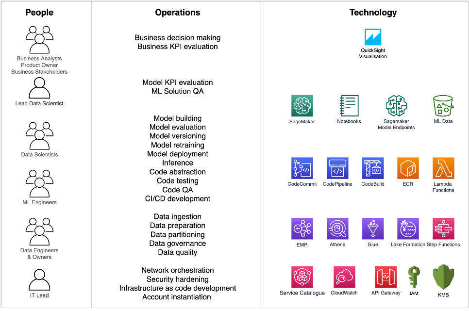

In addition, the reader of this document will learn about the key phases of building an MLOps foundations; how the multiple personas will work together on this foundation; and how the Amazon SageMaker purpose-built tools and built-in integrations with other AWS services that can accelerate the adoption of ML across an enterprise business.


## MLOps Maturity Model

Building an MLOps foundation that can cover the operations, people and technology needs of enterprise customers is challenging. Therefore, we define the following maturity model that defines the necessary capabilities of MLOps in four key phases.

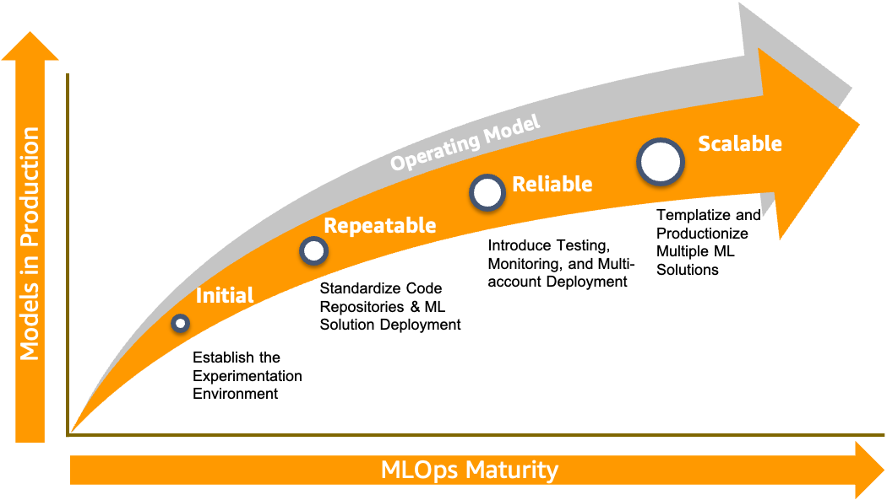

1. **Initial phase:** During this phase, the data scientists are able to experiment, build/train/deploy models on AWS using Amazon SageMaker services. The suggested development environment is SageMaker Studio in which the data scientists are able to experiment and collaborate based on SageMaker Studio Notebooks.
2. **Repeatable phase:** Having the ability to experiment on AWS, the next step is to create automatic workflows to pre-process data and build/train models, i.e. ML pipelines. The Data Scientists collaborate with ML Engineers in a separate environment to build robust and production ready algorithms/source code, orchestrated using SageMaker Pipelines. The generated models are stored and benchmarked in the SageMaker Model Registry.
3. **Reliable phase:** Even if the models have been generated via the ML pipelines, they need to be tested before they get promoted to the production. Therefore, in this phase, the automatic testing methodology is being introduced, for both model and triggering infrastructure, in an isolated staging (pre-production) environment that simulates production. After the successful run of the test the models are being deployed to the isolate environment of production. To promote the models among the multiple environments, manual evaluation and approvals are required.
4. **Scalable phase:** After the productionization of the first ML solution, the scaling of the MLOps foundation to support multiple data science teams to collaborate and productionize tens or hundreds of ML use cases is necessary. In this phase, we introduce the templetization of the solutions that brings speed to value to our customer by reducing the development time of new production solutions from weeks to days. Additionally, we automated the instantiation of secure MLOps environments to enable multiple teams to operate on their data reducing the dependancy and overhead to the IT.


In the following sections, we show how our customers build an MLOps foundation based on the above maturity model and based on the following tenets:

* **Flexibility:** Data scientists are able to accommodate any framework (e.g. TensorFlow, PyTorch)
* **Reproducibility:** Data scientists are able to recreate or observe past experiments (e.g. code, data, results).
* **Reusability:** Data scientists and ML engineers are able to reuse source code and ML pipelines avoiding inconsistencies and cost.
* **Scalability:** Data scientists and ML engineers are able to scale resources and services on demand.
* **Auditability:** Data scientists, IT,  and legal department are able to audit logs, versions and dependencies of artifacts and data.
* **Consistency:** As MLOps consists of multiple environments, the foundation needs to eliminate variance between environments

## Initial phase - Establish Experimentation Environment

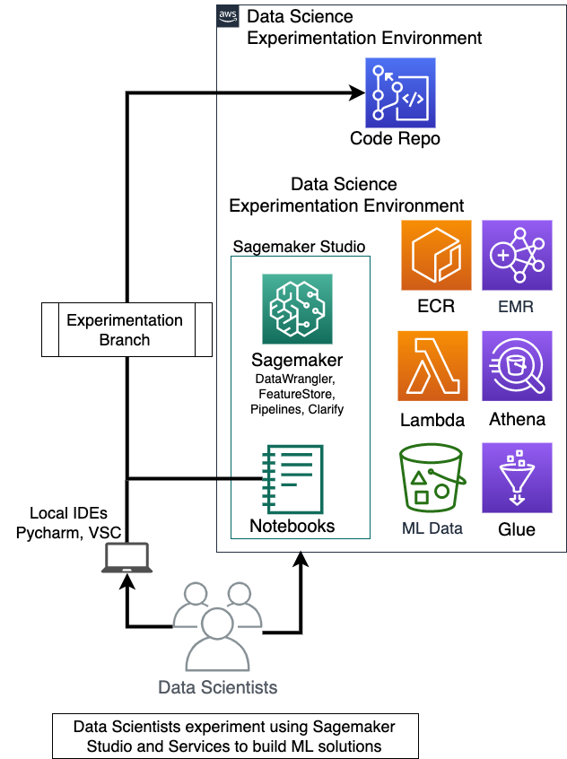

In the initial phase, the goal is to create a secure experimentation environment, where the data scientist receives snapshots of data and experiment using Sagemaker notebooks trying to prove that ML can solve a specific business problem. To achieve this, a Sagemaker Studio environment with tailored access to services via VPC endpoints is recommended. Source code of the reference architecture can be found in the examples provided by Sagemaker team in [“Secure Data Science With Amazon SageMaker Studio Reference Architecture“](https://github.com/aws-samples/amazon-sagemaker-studio-secure-data-science-workshop#private-network-per-amazon-sagemaker-studio-and-data-science-environment).
In addition to Sagemaker services, data scientists can use other services to process the data such as Amazon EMR, Athena and Glue, while the notebooks are stored and versioned into CodeCommit repositories (see figure above).

## Repeatable Phase

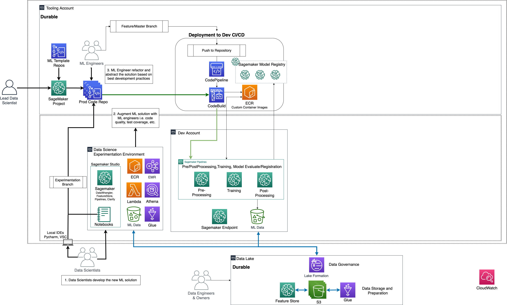

After the data scientists have proven that ML can solve the business problem and been familiarised with Sagemaker experimentation, training and deployment of models, the next step is to start productionizing the ML solution. At this stage, separation of concern is necessary. We split the environment into multiple AWS accounts:

1. **Data Lake:** stores all the ingested data from on-premise (or other systems) to the cloud. Data engineer are able to create Extract, Transform, and Load (ETL) pipelines combining multiple data sources and preparing the necessary datasets for the ML use cases. The data is catalogued via Glue catalogue and shared with other users and accounts via Lake Formation (i.e. data governance layer). In the same account, [Feature Store](https://aws.amazon.com/blogs/machine-learning/enable-feature-reuse-across-accounts-and-teams-using-amazon-sagemaker-feature-store/) can be hosted but we don’t cover it this post.
2. **Experimentation:** enables data scientist to conduct their research. The only difference is that the origin of the data snapshots is the data lake. Data scientists have access only in a specific datasets which can be anonymised in case of GDPR or other data privacy constraints. Furthermore, experimentation account may have access to internet to enable data scientists to use new data science frameworks or third-party open-source libraries. Therefore, experimentation account considered as part of the non-production environment.
3. **Development (dev):** The first stage of the production environment. The data scientists move from notebooks to the world of automatic workflows and Sagemaker Pipelines. They need to collaborate with ML engineers to abstract their code, ensure coverage of testing, error handling and code quality. The goal is to develop ML pipelines, i.e. automatic workflows which preprocess, train, evaluation and register models to the Sagemaker Model Registry. The deployment of the ML pipelines is driven only via CI/CD pipelines, while the access to the AWS console is restricted. Internet connect is not allowed as the ML pipeline has access to production data in the Data Lake (read only).
4. **Tooling (or automation):** hosts the CodeCommit repositories, CodePipeline CI/CD pipelines, Sagemaker Model Registry and ECR to host custom containers. As data lake is the single point of truth for the data, tooling account is for the code, containers, and produced artifacts.

Note that the above account naming convention and multi-account strategy may vary depending on the business needs but this structure is meant to show the recommended levels of isolation. For example, development account may renamed to model training or build account.

To achieve the automatic deployment, it is important to understand how to move from notebooks to ML pipelines and standardize the code repositories and data structure.

### From Notebooks to ML Pipelines

The goal of the development environment is to restructure, augments, improve and scale the code in notebooks and move it to the ML pipelines. An ML pipeline is a set of steps which are responsible to pre-process the data, train or use models, and post-process the results. Each step should perform one exactly task (e.g. specific transformation) and be abstract enough (e.g. pass column names as input parameters) to enable re-usability.

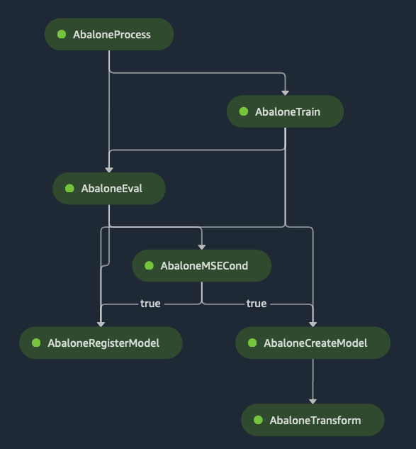


To implement ML pipelines the data scientists (or ML engineers) leverage Amazon Sagemaker Pipelines. An Amazon SageMaker Pipeline is a series of interconnected steps (e.g. Sagemaker Processing Jobs, Training, HPO) that is defined by a JSON pipeline definition using a Python SDK. This pipeline definition encodes a pipeline using a directed acyclic graph (DAG). This DAG gives information on the requirements for and relationships between each step of your ML pipeline.

Depending the use, the ML pipeline can be separated into two main types, i.e. training and batch inference. The training ML pipelines could follow this flow:

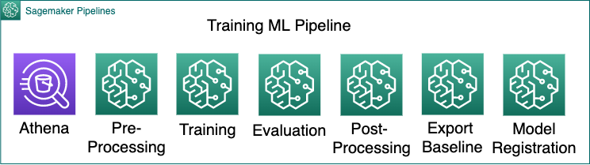

Pre-processing phase might consist of multiple steps. Common data science transformations are data splitting/sampling (train, validation, test set), one-hot encoding/vectorization, binning, scaling. The model training step could be either one training job, if the data scientist is aware of the best model configuration, or hyper-parameter optimization (HPO) job, where AWS define the best hyper parameters for the model (Bayesian method) and produces the corresponding model artifact. In the evaluation step, the produced model artifact is used to perform inference to the validation dataset. Then, the ML pipeline checks if the produced accuracy metrics (e.g. F1, precision, gain deciles) pass the necessary thresholds. If this step is successful, then the model artifacts and metadata are moved to the model registry for productionization. Note that export baseline step exploits SageMaker Model Monitor functionality producing a json objects with the statistics that will be used later for model drifting detection and can be hosted into the SageMaker Model Registry as model metadata.

In case of batch inference, the data scientists are able to create similar pipelines:

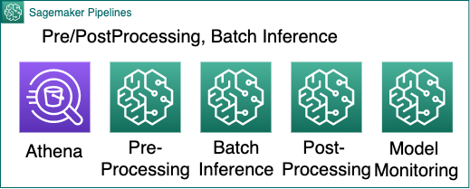

The pre-processing step of batch inference is most of the times same as training by excluding data sampling and the column of ground truth. Batch inference is the step which sends data in batches for inference to the corresponding endpoint and can be implemented by leveraging [Batch Transform](https://docs.aws.amazon.com/sagemaker/latest/dg/batch-transform.html). The post-processing step produces additional statistics, e.g. result distribution, or join the results with external ids. Then, a model monitor step is able to compare the baseline
statistics of the data used for training (i.e. model json metadata in the Model Registry) against the new incoming data for inference.

The pre-processing steps could be skipped if the data scientists create pipeline models which can be stored into the SageMaker Model registry. More details can be found “[Host models along with pre-processing logic as serial inference pipeline behind one endpoint](https://docs.aws.amazon.com/sagemaker/latest/dg/inference-pipelines.html)”.

### Standardising Repositories

To enable the collaboration between Data Scientists and ML Engineers, the standardization of code repository structure is necessary. In addition, the standardization is beneficial for the CI/CD pipeline structure enabling the incorporation of automatic validation, building (e.g. custom container building), and testing steps.

The following example illustrates the separation of the ML solutions into two repositories: (a) building/training repository for training (and optionally pipeline model), and (b) deployment to promote the batch inference pipeline models or instantiate the real time endpoints.

```
# Building/Training Repository
algorithms/
    shared_libraries/
        test/
            input/ # (optional)
            output/ # (optional)
            test_<step>.py
        <help_functions1>.py
        <help_functions2>.py
        README.md
    preprocessing/ # 1 folder per pre-processing job, order is defined in the ml pipeline logic
        <preprocessing_job_name1> # e.g classic ml: one hot encoding
            test/
                input/ # (optional)
                output/ # (optional)
                test_<step>.py
            __main__.py
            dockerfile # (optional) define dockerfile in case of custom containers
            README.md
       <preprocessing_job_name2> # e.g classic ml: one hot encoding
        ...
    training/ # (optional) each one is a training job in SageMaker
        <training_job_name>/
            test/
                input/ # (optional)
                output/ # (optional)
                test_<step>.py
            __main__.py
            README.md
    inference/ # (optional) for batch inference
        <batch_inference_job_name>/ # one job per training job name if we're building multiple models
            __main__.py
            README.md
    postprocessing/ # each one is a processing job in SageMaker
        <postprocessing_job_name1>/
            test/
                input/ # (optional)
                output/ # (optional)
                test_<step>.py
           __main__.py
            README.md
        <postprocessing_job_name2>/
        ...
ml_pipelines/
    training/ # (note) Multiple training ML pipelines can be defined
        ml-pipeline-training.py # Define training ML pipelines using SageMaker Pipeline SDK
        input.json # (optinal - json or yaml) ML pipeline configuration to enable reusability
    README.md
notebooks/
    *.ipynb # the original notebooks as has been created by the data scientists
    README.md
build_spec.yml
README.md

# Deployment Repository
inference_config/
    staging/
        inference_config.json # Batch inference ML pipeline or real-time model endpoint configuration to enable reusability
    prod/
        inference_config.json # Batch inference ML pipeline or real-time model endpoint configuration to enable reusability
    README.md
app_infra/
    api_gateway/...
    lambda/...
    event_bridge/...
    batch_inference/ml-pipeline-inference.py # Define batch inference SageMaker Pipeline
tests/
    integration_test/
        test_<description>.py
        test_<description>.py
        # …
    stress_test/
        test_<description>.py
    other_test/
        test_<description>.py
    README.md
README.md
```

Building/training repository is divided into three main folder:

1. **Algorithms:** The Data Scientists  develop the code for each step of the ML pipelines into the *algorithms* root folder. The steps can be grouped in pre-processing, training, batch inference, post-processing (e.g. evaluation). In each group, multiple steps can be defined in corresponding sub-folders, which contain a folder for the unit tests (including optional inputs and outputs), the main functions, the readme, and a dockerfile in case of a custom container need. In addition to main, multiple code files can be hosted in the same folder. Common helper libraries for all the steps can be hosted in a *shared library* folder. Note that the Data Scientists are responsible for the development of the unit tests as they own the logic of the steps, while ML engineers are responsible for the error handling enhancement and test coverage recommendation. The CI/CD pipeline is responsible to run the tests, build the containers automatically (if necessary), and package the multiple source code files.
2. **ML Pipelines:** Having developed the source code and tests of each step, the next step is to define the Sagemaker Pipelines in another root folder.  Each ML pipeline definition is placed in sub-folder that contains the *.py* file and a json or yaml file for input parameters, such as hyper-parameter ranges. A readme file to describe the ML pipelines is necessary.
3. **Notebooks:** folder hosts the origin notebooks that data scientist used during experimentation.

Deployment repository consists of three main parts:

1. **Inference Configuration:** contains the configuration of real time endpoints or batch inference per development environment, such as instance types
2. **Application Infrastructure:** Hosts the source code of the infrastructure necessary to run **** the inference if it is necessary. As an example, this might be triggering mechanism via EventBridge, API Gateway, Lambda Functions, or SageMaker Pipelines.
3. **Tests:** consists of multiple subfolder depending on the customer testing methodology. We suggest as minimum set of tests, the integration test (end-to-end run of the inference including application infrastructure), stress test (examine edge cases), and ML tests (e.g. the distribution of confidence scores or probabilities).

By committing changes to the building/training repository, a CI/CD pipeline is responsible to validate the repository structure, perform the tests, deploy and run the ML pipelines. A different CI/CD pipeline will be responsible for the promotion of the models that we examine in the following section.

### Standardising Repository Branching & CI/CD

To ensure the robustness of the ML pipelines in the dev account, a multi-branching repository strategy is suggested, while the deployment is performed via CI/CD pipelines only. Data scientists should utilise a feature branch to develop their new functionality (source code) and once they are ready to deploy the corresponding ML pipelines, they can then push this into the develop branch. An alternative to this approach is to allow the deployment of ML pipelines per feature branch.  “[Improve your data science workflow with a multi-branch training MLOps pipeline using AWS](https://aws.amazon.com/blogs/machine-learning/improve-your-data-science-workflow-with-a-multi-branch-training-mlops-pipeline-using-aws/)” describes this alternative.

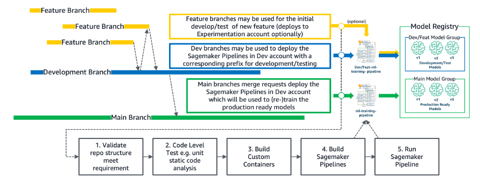

The figure above illustrates the branching strategy and the necessary CI/CD pipeline steps that we run in the dev environment for ML pipeline and model building. Code example of multi-branch approach can be found in _Multi-Branch MLOps training pipeline_. Note that we can store the models produced by a feature branch-based ML pipeline in a separate feature Model group and decommission them during a merge request with the Main branch. The models into the main model group will be the ones that will be promoted to production.

### Standardising Data Structure

Equally importance to source code standardisation is the structure standardisation of the data, allowing Data Scientists and ML Engineers to debug, audit, and monitor the origin and history of the models and ML pipelines. The following diagram illustrates such an example.

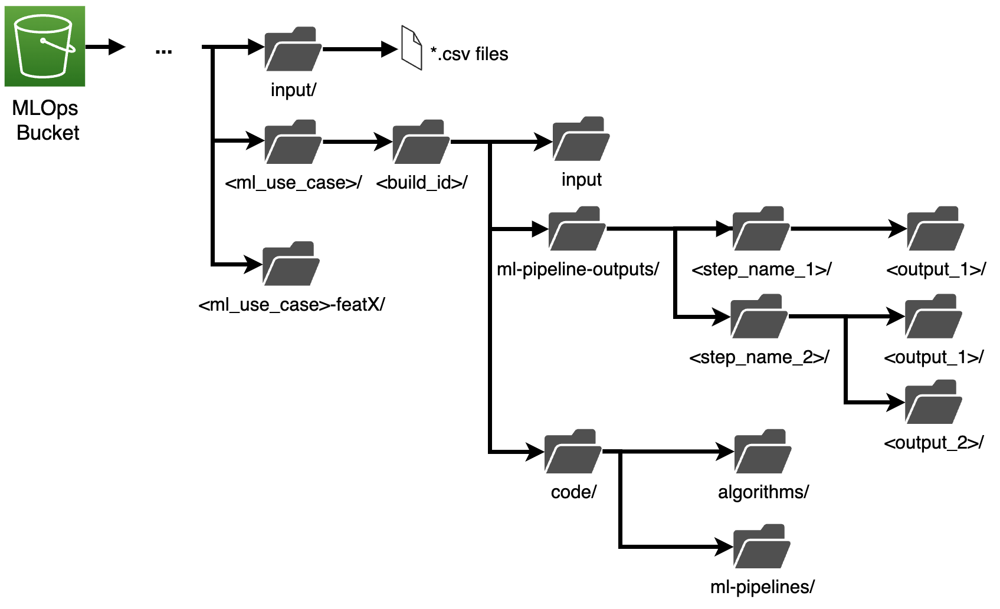

For simplicity, let’s assume that the input historical data lands into a bucket of the development account under the *input* sub-key (normally this is located into the data lake). For each ML use case, a separate sub-key needs to be created. To trigger a new ML Pipeline execution, the data scientist should perform a git commit/push which triggers the CI/CD pipeline. Then, the CI/CD pipeline creates a sub-key by copying the code artifacts (i.e. *code* sub-key) and input data (i.e. *input* sub-key) under a sub-partition of *build id.* As an example, ** the *build id c*an be a combination of date-time and git hash or Sagemaker Pipeline Execution Id. This structure will enable date scientist to audit and query past deployments and executions. After this, the CI/CD pipeline deploys and triggers the ML pipeline. During the execution of the ML pipeline, each step exports the intermediate results to *ml-pipeline-outputs*. It is important to remind that different feature branches deploy and run a new instance of ML pipelines which need to create a new sub-key with pre- or post-fix the feature branch id.

The above approach supports complete auditability to every experimentation. However, if we consider the multi-branching approach of the development strategy, this approach generates a large amount of data. Therefore, a data lifecycle strategy is necessary. The suggestion at this point is to delete at least the data of each feature-branch ML pipeline in every successful pull/merge request. But this depends on the operating model and audit granularity the business needs to support. Similar approach can be used in the batch inference ML pipelines.

## Reliable Phase

After the initial separation of concerns among Data Scientists, ML Engineers and Data Engineers by using multiple accounts, the next step is to promote the produced models from the model registry to an isolated environment to perform inference. However, we need to ensure the robustness of the deployed models. Therefore, the simulation of the deployed model to a mirror environment of production is mandatory, i.e. pre-production (or staging).

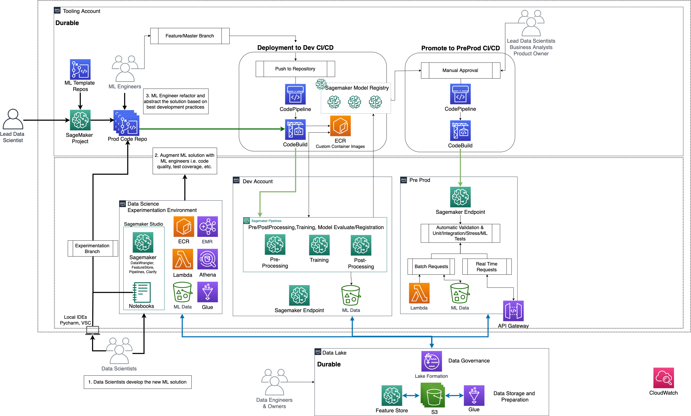

The promotion of a model and endpoint deployment in pre-production environment is performed leveraging the model registry status update events (or git push on the deployment repository) which trigger a separate CI/CD pipeline by leveraging Amazon EventBridge events. The first step of the CI/CD pipeline requests a manual approval by the Lead Data Scientist (and optionally Product Owner, Business Analyst or other Lead Data Scientists). The approver(s) needs to validate the performance KPIs of the model and QA of the code in the deployment repository.  After the approval, the CI/CD pipeline runs the test code into the deployment repository (e.g. integration test, stress test, ML test). In addition to the model endpoint, the CI/CD tests also the triggering infrastructure, such as EventBridge, Lambda functions or API gateway.

[Image: ReliablePhase2-Latest Version.png]

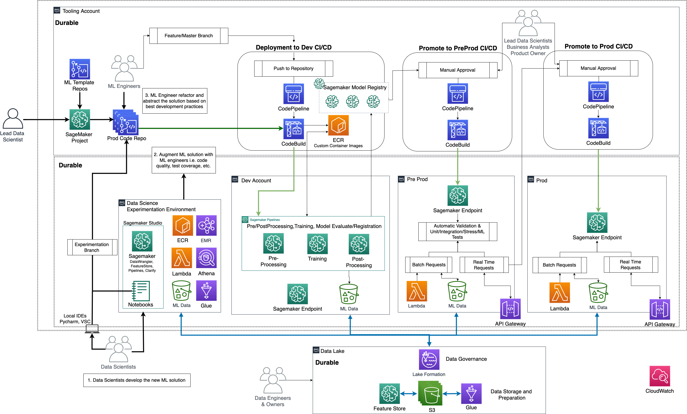

After the successful run of the tests, the CI/CD pipeline notifies new (or same) approvers that a model is ready to be promoted to production. At this stage, business analyst might want to perform some additional statistical hypothesis tests on the results of the model. After the approval the models and the triggering infrastructure are deployed in production. Multiple deployment methods are supported by Amazon Sagemaker, such as blue/green, Canary, and A/B testing (see more in the “[Deployment Guardrails](https://docs.aws.amazon.com/sagemaker/latest/dg/deployment-guardrails.html)”). If the CI/CD pipeline fails then a rollback mechanism returns the system to the latest robust state.

The following diagram illustrates the main steps of the CI/CD pipeline to promote a model and the infrastructure to trigger the model endpoint, such as API Gateway, Lambda functions, and EventBridge.

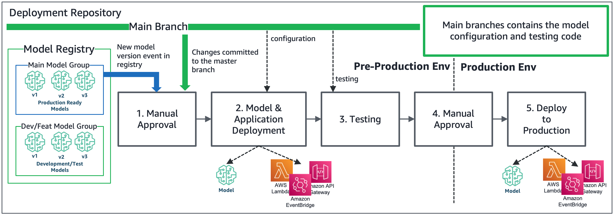

### Data Lake & MLOps Integration

At this point, it is important to understand the data requirements per development stage or account, and the way to incorporate MLOps with a centralised Data Lake. The following diagram illustrates the MLOps and Data Lake layers.

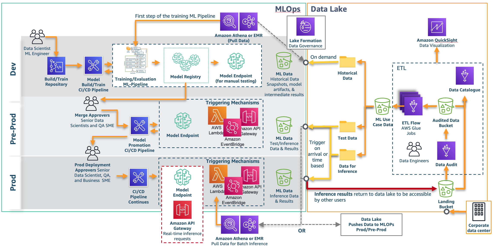

In the data lake the Data Engineers are responsible to join multiple data sources and create the corresponding datasets (e.g. single table of structure data, single folder with PDF files or images) for the ML use cases by building ETL pipelines as has been defined by the data scientists (e.g. during the exploration data analyses phase). Those datasets can be split into historical data, data for inference and testing. All the data is being catalogued (e.g. Glue catalogue) and can be shared with other accounts and users by leveraging Lake Formation as a data governance layer (for structured data). Note that, currently, Lake Formation is compatible only with Athena Queries, Glue Jobs, and EMR.

On the other hand, MLOps environment needs to irrigate the ML pipelines with specific datasets located into local buckets in dev, pre-prod, and prod. The dev environment is responsible for building and training the models on demand using Sagemaker Pipelines pulling data from the Data Lake. Therefore, we suggest as first step of the Sagemaker Pipelines either an Athena step, in the case where only data sampling/query is required, or an EMR step if more complex transformations are required. Note that, as an alternative, a Glue job could be leveraged via a callback step but not as a native step as yet in the Sagemaker Pipelines.

Pre-prod and prod are responsible for either testing or conducting real-time and batch inference. In the case of real-time inference, sending data to the MLOps pre-prod/prod accounts is not necessary as the input for inference can be piggy-bagged in the payload of the Gateway API request. In the case of batch inference (or large size input data), the necessary datasets, either test data or data for inference, need to land in the local ML Data buckets respectively (i.e. pre-prod/prod). There are two options of moving data to pre-prod and prod, either by triggering Athena/EMR pulling data from the Data Lake, or pushing data from the Data Lake to those MLOps accounts. The first option requires the development of additional mechanisms in the MLOps accounts, for example, create scheduled EventBridge events (without knowledge if the data in the Data Lake has been updated) or on-data arrival in S3 EventBridge events in the Data Lake (see more details in [“Simplifying cross-account access with Amazon EventBridge resource policies”](https://aws.amazon.com/blogs/compute/simplifying-cross-account-access-with-amazon-eventbridge-resource-policies/)). After catching the event in the MLOps side, an Athena query or EMR can fetch data locally and trigger [Asynchronous Inference](https://docs.aws.amazon.com/sagemaker/latest/dg/async-inference.html) or [Batch Transform](https://docs.aws.amazon.com/sagemaker/latest/dg/batch-transform.html). This can be wrapped into a Sagemaker Pipeline for simplicity. The second option is to add in the last step of the ETL pipeline the functionality of pushing data to the MLOps buckets. However, this approach mixes the responsibilities (i.e. Data Lake triggers inference) and requires Lake Formation to provide access to the Data Lake to write in the MLOps buckets.

The last step, is to move the inference results back to the Data Lake. To catalogue the data and make it available to other users, the data should return as a new data source back to the Landing Bucket.

## Scalable Phase

After the development of the MLOps foundation and the end-to-end productionization of the first ML use case, the infrastructure of dev, pre-prod, prod, and the repository, CI/CD pipeline and data structure have been tested and finalised. The next step is to onboard new ML use cases and teams into the platform. To ensure speed-to-value, Sagemaker allows the users to create custom Sagemaker Project templates which can be used to instantiate template repositories and CI/CD pipelines automatically. By having such Sagemaker Project templates the lead Data Scientists are responsible to instantiate new projects and allocate dedicate team per new ML use case.

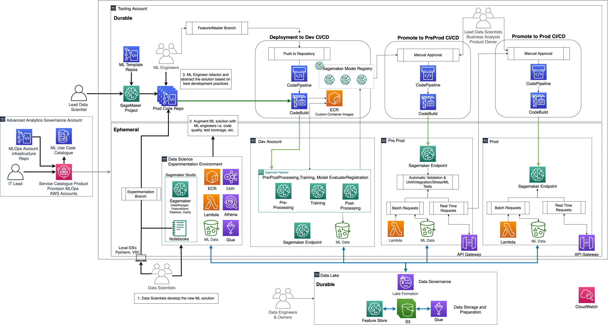

The problem becomes more complex if different data scientist teams (or multiple business units which need to productionize ML) have access to different confidential data and multiple Product Owners are responsible to pay a separate bill for the training, deployment and execution of the models. Thus, a separate set of MLOps accounts (i.e. experimentation, dev, pre-prod, prod) per team is necessary. To enable the easy creation of new MLOps accounts, we introduce another account, i.e. Advanced Analytics Governance account,  which is accessible by IT members and allow them to catalogue, instantiate, or decommission MLOps accounts on demand. Specifically, this account hosts repositories with the infrastructure code of the MLOps accounts (e.g. VPC, subnets, endpoints, buckets, IAM roles and policies, CloudFormation stacks), a Service Catalogue product to automatically deploy the Cloud Formation stacks of the infrastructure to the multiple accounts with “one-click”, and a DynamoDB table to catalogue metadata, such as which team is responsible for each set of accounts. By having this capability, the IT team instantiates MLOps accounts on demand and allocated the necessary users, data access per account, and consistent security constraints.

Based on the above scenario, we separate the accounts to ephemeral and durable. Data Lake and Tooling are durable accounts and play the role of single point of truth for data and source code respectively. MLOps accounts are mostly stateless and be instantiated or decommissioned on demand, making them ephemeral. Even if a set of MLOps accounts is decommissioned, the users or auditors are able to check past experiments and results as they are stored into the durable environments.

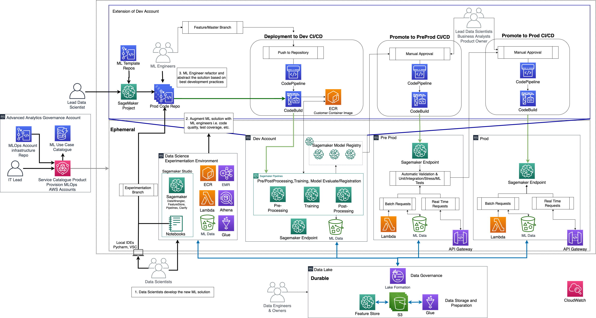

If the user wants to use Sagemaker Studio UI for MLOps, the tooling account is part of the dev account as per the figure above.  In this repository, we have build this architecture with the difference that we have merged experimentation account with dev, and we haven't implemented a data lake to simplify the deployment for the users.

Note that Sagemaker provide the capability to replace CodeCommit and CodePipeline by other third party development tool, such as GitHub and Jenkins (more details can be found in [“Create Amazon SageMaker projects using third-party source control and Jenkins“](https://aws.amazon.com/blogs/machine-learning/create-amazon-sagemaker-projects-using-third-party-source-control-and-jenkins/)).

## Conclusion

A robust MLOps foundation, which defines clearly the interaction among multiple personas and technology, can increase speed-to-value and reduce cost, while enable data scientists to focus on innovations. In this post, we have showed how to build such a foundation in phases leading to a smooth MLOps maturity of the business achieving to support multiple data science teams and ML use cases into production. We have defined an operating model consisting of multiple personas with multiple skills and responsibilities. Finally, we shared examples on how to standardize the code development (repositories and CI/CD pipelines), data storage and sharing, and MLOps secure infrastructure provisioning for enterprise environments. Overall, multiple enterprise customers have adopted this approach and are able to productionize their ML solutions within days instead of months.

If you have any comments or questions, please contact:

Sokratis Kartakis <kartakis at amazon.com\>

Fatema Alkhanaizi <alkhanai at amazon.com\>

Georgios Schinas <schinasg at amazon.co.uk\>
