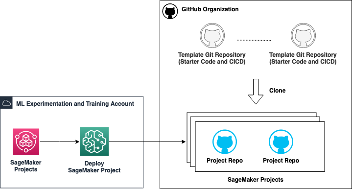
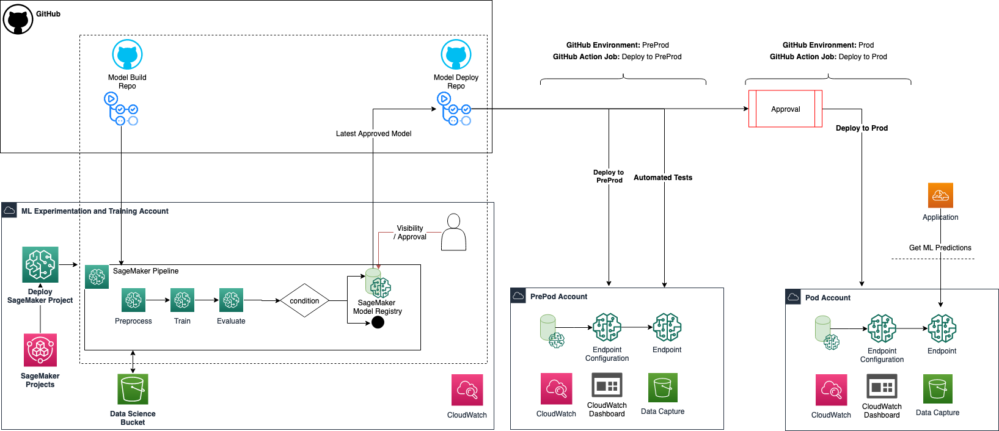
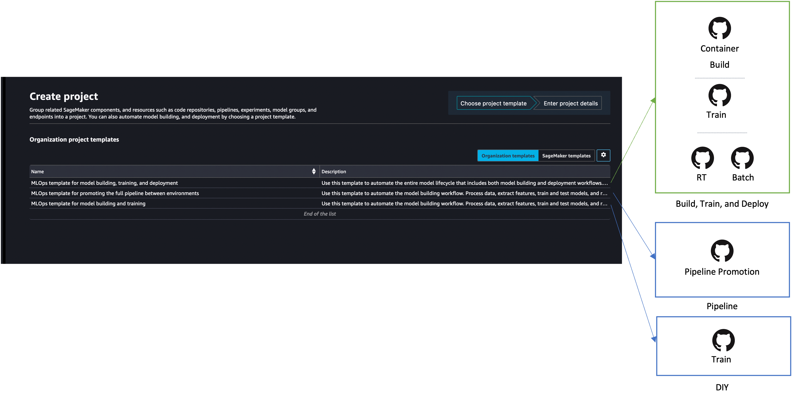

# SageMaker MLOps Multi Account Setup with GitHub and Terraform

## Introduction

As enterprise businesses embrace Machine Learning (ML) across their organisations, manual workflows for building, training, and deploying ML models tend to become bottlenecks to innovation. To overcome this, enterprises needs to shape a clear operating model defining how multiple personas, such as Data Scientists, Data Engineers, ML Engineers, IT, and Business stakeholders, should collaborate and interact, how to separate the concerns, responsibilities and skills, and how to leverage AWS services optimally. This combination of ML and Operations, so-called MLOps, is helping companies streamline their end-to-end ML lifecycle and boost productivity of data scientists while maintaining high model accuracy and enhancing security and compliance.

## High level architecture

In this repository, we show how to use **Terraform** with **GitHub and GitHub Actions** to build a baseline infratsturcture for secure MLOps. The solution can be broken down into three parts:

**Base Infrastructure**

The necessary infrastructure componenets for your accounts including SageMaker Studio, Networking, Permissions and SSM Parameters.


**Shared Template Repositories**

GitHub template repositories that are cloned when a custom SageMaker Project is deployed by a Data Scientist or ML Engineer.



**User Experience**

This is how the end-users (Data Scientists or ML Engineers) use SageMaker projects.

Typically, when a SageMaker project is deployed:
- GitHub private repos are created from templates that Data Scientists need to customize as per their use-case.
- These tempalates show best practices such as testing, approvals, and dashboards. They can be fully customized once deployed.
- Depending on the chosen SageMaker project, other project specific resources might also be created such as a dedicated S3 bucket for the project and automation to trigger ML deployment from model registry.

An architecture for the `Building, training, and deployment` project is shown below.



Currently, three example project template are available.

1. **MLOps Template for Model Building, Training, and Deployment**: ML Ops pattern to train models using SageMaker pipelines and to deploy the trained model into preproduction and production accounts. This template supports Real-time inference, Batch Inference Pipeline, and BYOC containers.

2. **MLOps Template for promoting the full ML pipeline across environments**: ML Ops pattern to shows how to take the same SageMaker pipeline across environements from dev to prod.

3. **MLOps Template for Model Building and Training**: MLOps pattern that shows a simple one-account SageMaker Pipeline setup.

Based on the selected project and its setting, SageMaker projects clones GitHub repos using templates. It also sets the secrets, environment vairables, and deployment environments.



## Prerequisites

The instructions here assume the following prerequisites. Make a note of these details to use in following sections.

1. AWS Account(s) with sufficient permissions to deploy base infrasturcure. We recommended using at least three AWS accounts for a Dev, Preprod, and Prod envrionment for one business-unit. However, you can deploy the infrastructure using one account for testing purposes. 
2. A GitHub Organization.
3. Personal Access Token (PAT) for GitHub organization. It is recommended to create a service/platform account and use it's PAT.


## How to use:

### Bootstrap you AWS Accounts  

This section explains the steps required to bootstrap your accounts for GitHub and Terraform. 

> **_NOTE:_** You can skip directly to [CloudFormation template](#cloudformation-template-for-bootstrapping) section to avoid manual bootstrapping.

#### GitHub Actions using OpenId Conenect

To avoid using long-term [AWS Identity and Access Management (IAM)](https://aws.amazon.com/iam/) user access keys, we can configure an [OpenID Connect (OIDC)](https://openid.net/connect/) identity provider (idP) inside an AWS account which allows the use of IAM roles and short-term credentials. Follow detailed instructions at [Use IAM roles to connect GitHub Actions to actions in AWS](https://aws.amazon.com/blogs/security/use-iam-roles-to-connect-github-actions-to-actions-in-aws/) or use the CloudFormation template provided below.

#### Terraform S3 and DynamoDB Backend

Terraform backend supports [Amazon S3 and DynamoDB](https://developer.hashicorp.com/terraform/language/settings/backends/s3) for storing states and locking consistency checking. 

Create the following resources in each AWS account or use the CloudFormation template provided below.
1. S3 Bucket: `${Prefix}-${Environment}-${AWS::Region}-${AWS::AccountId}`
2. DynamoDB Table: `${Prefix}-${Environment}`

Where, 
`Prefix`: Common name for resources. e.g. `mlops`
`Environment`: dev or preprod or prod

#### CloudFormation Template for bootstrapping

A [bootstrap.yaml](bootstrap.yaml) CloudFormation template has been provided. This can be deployed to each AWS account manually. Later, bootstrapping can be standardised and automated via [CloudFormation StackSets](https://docs.aws.amazon.com/AWSCloudFormation/latest/UserGuide/what-is-cfnstacksets.html) for an [AWS Organization](https://docs.aws.amazon.com/organizations/latest/userguide/services-that-can-integrate-cloudformation.html).

You can get started with one account but we recommend creating at least 3 AWS accounts: a dev, preprod, and prod account.

Deploy the provided `bootstrap.yaml` CloudFormation template in your account(s) either using the AWS console or using aws cli as shown below, from the root of the repo.

1. Ensure AWS CLI is [installed](https://docs.aws.amazon.com/cli/latest/userguide/getting-started-install.html) and [credentials are loaded](https://docs.aws.amazon.com/cli/latest/userguide/cli-configure-files.html) for the target account that you want to bootstrap. 

2. Identify the following:  
  a. Environment Type of the account: `dev`, `preprod`, or `prod`  
  b. Name of your GitHub Organization  
  c. (Optional) Customize S3 buckect name for Terraform state files by chosing a prefix.  
  d. (Optional) Customize DynamoDB Table Name for State Locking.  

3. Run the following command updating the details from step 2.

```bash
# Update
export $ENV=xxx
export $GITHUB_ORG=xxx
# Optional
export $TerraformStateBucketPrefix=terraform-state
export $TerraformStateLockTableName=terraform-state-locks


aws cloudformation create-stack \
  --stack-name YourStackName \
  --template-body ./bootstrap.yaml \
  --parameters ParameterKey=Environment,ParameterValue=$ENV \
               ParameterKey=GitHubOrg,ParameterValue=$GITHUB_ORG \
               ParameterKey=OIDCProviderArn,ParameterValue="" \
               ParameterKey=TerraformStateBucketPrefix,ParameterValue=$TerraformStateBucketPrefix \
               ParameterKey=TerraformStateLockTableName,ParameterValue=$TerraformStateLockTableName
```

> **_NOTE:_**: if you change the TerraformStateBucketPrefix or TerraformStateLockTableName parameters, you must update the environment variables (`S3_PREFIX`, `DYNAMODB_PREFIX`) in the [deploy.yml](base-infrastructure/.github/workflows/deploy.yml) to match.

This one-time deployment create the following resources in your AWS account: 

- For Terrafrom Backend: 
  - S3 Bucket to store state files. 
  -  DynamoDB table to store state locking.
- AWS Idenitity provider for GitHub actions using OIDC (as explained above)
- IAM Role to assume from GitHub Actions using the identity provider.

Once this is deployed, you're ready to move on to the next step. 

### Set up repositories in you GitHub Organization

We will move the code from this example to your GitHub Organization.

1. [base-infrastructure](./base-infrastructure/): An internal reposotry for Base Infrastructure which wil contain all code from `./sagemaker-mlops-terraform` folder.
2. [template-repos](./template-repos/): GitHub [template repositories](https://docs.github.com/en/repositories/creating-and-managing-repositories/creating-a-template-repository) with code from `./template-repos/**`. Make sure to use the same name as the folder name.

> **_Note_:** This is an important step to be able to deploy infrastructure. All further steps should be performed directly in your GitHub Organization.


## You are now ready!

Follow the [instructions in the base-infra reposotry](./base-infrastructure/README.md) to deploy MLOps infrastructure to your bootestrapped AWS accounts.

## Contacts

If you have any comments or questions, please contact:

The team who created the repo:  

- Jordan Grubb <jmgrubb@amazon.co.uk>
- Anirudh Gangwal <angangwa@amazon.co.uk>
- Irene Arroyo Delgado <iiarroyo@amazon.es>
