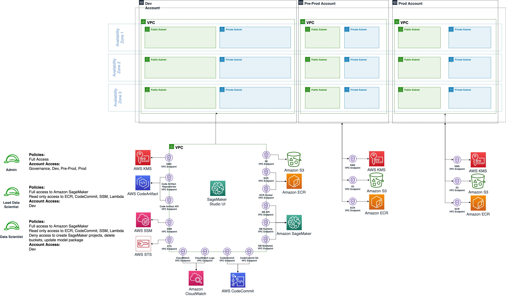

# Networking

This module deploys the required networking components and also published networking details as SSM parameters.

The following components are deployed:

- AWS VPC with private and public subnets
- VPC Flow Logs
- AWS PrivateLink [VPC Endpoints](https://docs.aws.amazon.com/whitepapers/latest/aws-privatelink/what-are-vpc-endpoints.html) for these services




> **_Note:_** This is an example setup and you can also import your existing VPC and networking settings.

<!-- BEGIN_AUTOMATED_TF_DOCS_BLOCK -->
## Requirements

No requirements.

## Usage
Basic usage of this module is as follows:
```hcl
module "example" {
	 source  = "<module-path>"

	 # Required variables
	 region  = 
}
```
## Providers

| Name | Version |
|------|---------|
| <a name="provider_aws"></a> [aws](#provider\_aws) | n/a |
## Modules

No modules.
## Resources

| Name | Type |
|------|------|
| [aws_cloudwatch_log_group.main](https://registry.terraform.io/providers/hashicorp/aws/latest/docs/resources/cloudwatch_log_group) | resource |
| [aws_eip.nat_eip](https://registry.terraform.io/providers/hashicorp/aws/latest/docs/resources/eip) | resource |
| [aws_flow_log.main](https://registry.terraform.io/providers/hashicorp/aws/latest/docs/resources/flow_log) | resource |
| [aws_iam_policy.vpc_flow_logs_policy](https://registry.terraform.io/providers/hashicorp/aws/latest/docs/resources/iam_policy) | resource |
| [aws_iam_role.vpc_flow_logs_role](https://registry.terraform.io/providers/hashicorp/aws/latest/docs/resources/iam_role) | resource |
| [aws_iam_role_policy_attachment.vpc_flow_logs_policy_attachment](https://registry.terraform.io/providers/hashicorp/aws/latest/docs/resources/iam_role_policy_attachment) | resource |
| [aws_internet_gateway.main](https://registry.terraform.io/providers/hashicorp/aws/latest/docs/resources/internet_gateway) | resource |
| [aws_nat_gateway.main](https://registry.terraform.io/providers/hashicorp/aws/latest/docs/resources/nat_gateway) | resource |
| [aws_route.private_nat_gateway](https://registry.terraform.io/providers/hashicorp/aws/latest/docs/resources/route) | resource |
| [aws_route.public_internet_gateway](https://registry.terraform.io/providers/hashicorp/aws/latest/docs/resources/route) | resource |
| [aws_route_table.private](https://registry.terraform.io/providers/hashicorp/aws/latest/docs/resources/route_table) | resource |
| [aws_route_table.public](https://registry.terraform.io/providers/hashicorp/aws/latest/docs/resources/route_table) | resource |
| [aws_route_table_association.private](https://registry.terraform.io/providers/hashicorp/aws/latest/docs/resources/route_table_association) | resource |
| [aws_route_table_association.private_2](https://registry.terraform.io/providers/hashicorp/aws/latest/docs/resources/route_table_association) | resource |
| [aws_route_table_association.public](https://registry.terraform.io/providers/hashicorp/aws/latest/docs/resources/route_table_association) | resource |
| [aws_route_table_association.public_2](https://registry.terraform.io/providers/hashicorp/aws/latest/docs/resources/route_table_association) | resource |
| [aws_security_group.main](https://registry.terraform.io/providers/hashicorp/aws/latest/docs/resources/security_group) | resource |
| [aws_ssm_parameter.private_subnet_id](https://registry.terraform.io/providers/hashicorp/aws/latest/docs/resources/ssm_parameter) | resource |
| [aws_ssm_parameter.sg_id](https://registry.terraform.io/providers/hashicorp/aws/latest/docs/resources/ssm_parameter) | resource |
| [aws_ssm_parameter.vpc_id](https://registry.terraform.io/providers/hashicorp/aws/latest/docs/resources/ssm_parameter) | resource |
| [aws_subnet.private](https://registry.terraform.io/providers/hashicorp/aws/latest/docs/resources/subnet) | resource |
| [aws_subnet.private_2](https://registry.terraform.io/providers/hashicorp/aws/latest/docs/resources/subnet) | resource |
| [aws_subnet.public](https://registry.terraform.io/providers/hashicorp/aws/latest/docs/resources/subnet) | resource |
| [aws_subnet.public_2](https://registry.terraform.io/providers/hashicorp/aws/latest/docs/resources/subnet) | resource |
| [aws_vpc.main](https://registry.terraform.io/providers/hashicorp/aws/latest/docs/resources/vpc) | resource |
| [aws_vpc_endpoint.events](https://registry.terraform.io/providers/hashicorp/aws/latest/docs/resources/vpc_endpoint) | resource |
| [aws_vpc_endpoint.logs](https://registry.terraform.io/providers/hashicorp/aws/latest/docs/resources/vpc_endpoint) | resource |
| [aws_vpc_endpoint.s3](https://registry.terraform.io/providers/hashicorp/aws/latest/docs/resources/vpc_endpoint) | resource |
| [aws_vpc_endpoint.sagemaker_api](https://registry.terraform.io/providers/hashicorp/aws/latest/docs/resources/vpc_endpoint) | resource |
| [aws_vpc_endpoint.sagemaker_runtime](https://registry.terraform.io/providers/hashicorp/aws/latest/docs/resources/vpc_endpoint) | resource |
| [aws_vpc_endpoint.sagemaker_studio](https://registry.terraform.io/providers/hashicorp/aws/latest/docs/resources/vpc_endpoint) | resource |
| [aws_vpc_endpoint.service_catalog](https://registry.terraform.io/providers/hashicorp/aws/latest/docs/resources/vpc_endpoint) | resource |
| [aws_vpc_endpoint.sts](https://registry.terraform.io/providers/hashicorp/aws/latest/docs/resources/vpc_endpoint) | resource |
## Inputs

| Name | Description | Type | Default | Required |
|------|-------------|------|---------|:--------:|
| <a name="input_region"></a> [region](#input\_region) | Region | `string` | n/a | yes |
## Outputs

| Name | Description |
|------|-------------|
| <a name="output_private_subnet_2_id"></a> [private\_subnet\_2\_id](#output\_private\_subnet\_2\_id) | n/a |
| <a name="output_private_subnet_id"></a> [private\_subnet\_id](#output\_private\_subnet\_id) | n/a |
| <a name="output_sg_id"></a> [sg\_id](#output\_sg\_id) | n/a |
| <a name="output_vpc_id"></a> [vpc\_id](#output\_vpc\_id) | n/a |
<!-- END_AUTOMATED_TF_DOCS_BLOCK -->