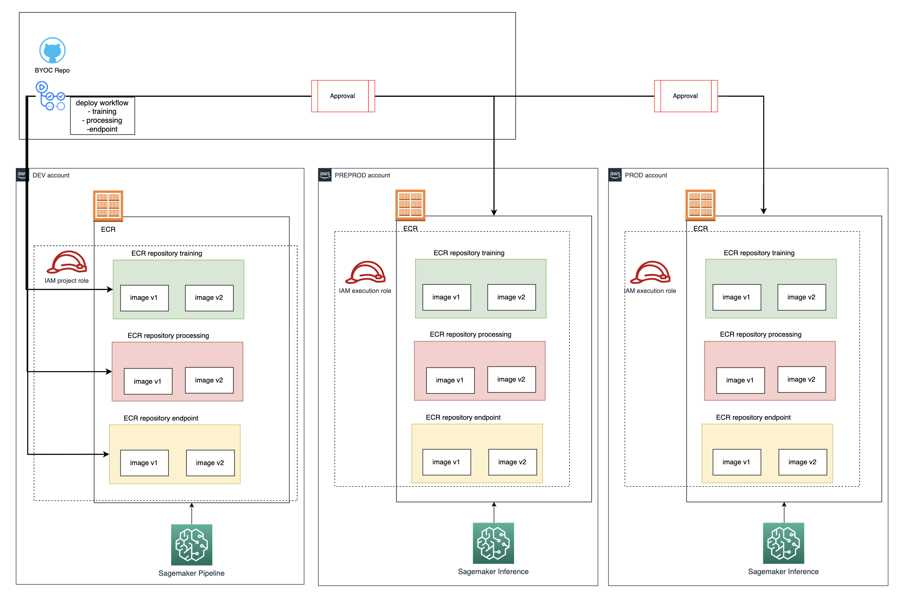

## MLOps for SageMaker Bring Your Own Container

This is a sample code repository for demonstrating how you can organize your code for creating/extending containers for SageMaker Processing, Training, and Endpoint. This code repository is created as part of creating a Project in SageMaker. 

Each container folder has a Dockerfile with the definition of the container and any additional file that is needed.

When a folder is updated, it triggers the corresponding workflow (processing, training and endpoint) that builds and pushes the images to ECR. First to DEV account, then to PREPROD and then after a manual approval to PROD.



## Layout of the SageMaker ModelBuild Project Template
```
|-- .github/
|   |--actions/ecr-build-and-push
|     |-- action.yml
|   |--workflows
|     |-- endpoint.yml
|     |-- processing.yml
|     |-- training.yml
|-- endpoint
|   |-- Dockerfile
|-- processing
|   |-- Dockerfile
|-- training
|   |-- Dockerfile
|-- README.md
```


`Dockerfile`

Docker container definition. In this example we extend SageMaker provided containers.

You can find more examples: https://sagemaker-examples.readthedocs.io/en/latest/training/bring_your_own_container.html

<!-- BEGIN_AUTOMATED_TF_DOCS_BLOCK -->
## Requirements

No requirements.

## Usage
Basic usage of this module is as follows:
```hcl
module "example" {
	 source  = "<module-path>"
}
```
## Providers

No providers.
## Modules

No modules.
## Resources

No resources.
## Inputs

No inputs.
## Outputs

No outputs.
<!-- END_AUTOMATED_TF_DOCS_BLOCK -->