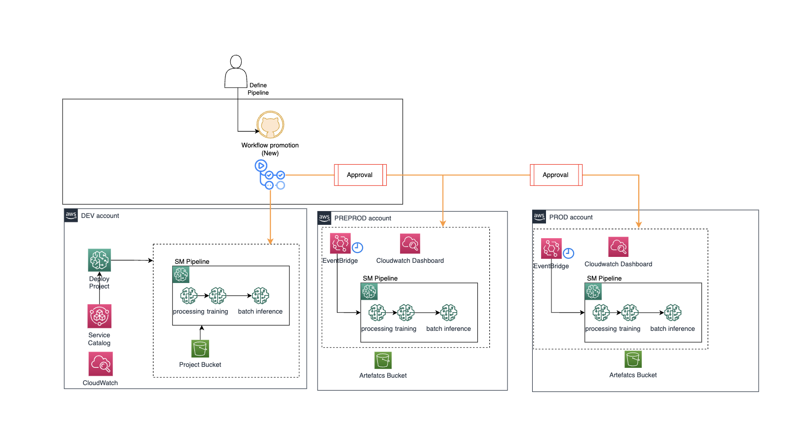

## MLOps for SageMaker Workflow Promotion Deployment 

This is a sample code repository for demonstrating how you can organize your code for creating a pipeline for training and batch inference and deploy the full pipeline in `dev`,`pre-prod` and `prod` . This code repository is created as part of creating a Project in SageMaker.

First, the sagemaker pipeline is deployed into `dev` account and executed. Then, when the user wants to promote the pipeline to the target account `pre-prod`, it is needed to manually approve the step in the Github Action workflow. And finally, to promote the pipeline to the target account `prod`, it is also needed to manually approve the step in the Github Action workflow.

To do the environment promotion, this code repository has the code to deploy the sagemaker pipeline in the pre-prod and prod account (`build.py`). It also has configuration files associated with `pre-prod` and `prod` stages where the sagemaker pipelines variables are set.

The cloudformation template deploys 2 Eventbridge rules that are scheduled to trigger the Sagemaker Pipeline for Batch inference - `staging` and `prod`. 

The template provides a starting point for bringing your SageMaker Pipeline development to production. It can be modified and its functionalities can be extended according to the use case, being a fully customizable template.



### Environment secrets

In order to get environment variables from AWS for the workflow execution, it is set environment secrets when the template repository is cloned for the specific project. They are used in the GitHub Action workflow.
The environment secrets are:

AWS_DEV_ACCOUNT_NUMBER: Account ID of the training AWS account

AWS_PROD_ACCOUNT_NUMBER: Account ID of the Production AWS account to where the endpoint is deployed

AWS_PREPROD_ACCOUNT_NUMBER: Account ID of the Pre Production AWS account where the endpoint is deployed

The environment variables are:

AWS_REGION: AWS account region

SAGEMAKER_PIPELINE_ROLE_ARN: IAM role arn to execute the pipeline

SAGEMAKER_PROJECT_ARN: Arn of the SageMaker project

SAGEMAKER_PROJECT_ID: ID of the SageMaker project

SAGEMAKER_PROJECT_NAME_ID: Name +ID of the SageMaker project

SAGEMAKER_PROJECT_NAME: Name of the SageMaker project


### Repository structure

```
|-- .github/workflows
|   |-- deploy.yml
|-- pipelines
|   |-- run_pipeline.py
|   |-- get_pipeline_definition.py
|   |-- _utils.py
|   |-- _version_.py
|   |-- _init_.py
|   |-- README.md
|   |-- batch_inference
|   |   |-- README.md
|   |   |-- pipeline.py
|   |   |-- preprocess.py
|   |   |-- evaluate.py
|-- tests
|   |-- test_pipelines.py
|-- README.md
|   |-- deploy_target
|   |-- batch-config-template.tf
|   |-- versions.tf
|   |-- variables.tf
|   |-- build.py
|   |-- utils.py
|   |-- pre-prod-config.tfvars.json
`   |-- prod-config.tfvars.json
```

A description of some of the artifacts is provided below.

```
|-- .github/workflows
|   |-- deploy.yml
```

- This file is used by the GitHub Action to deploy the pipeline in the dev, preprod and prod account.
It is triggered on dispatch, when a manual run is set from the Lambda when the SageMaker Model Package is approved and on push.
The workflow is divided in three jobs, the first one creates the deployment in the dev account and once deployed it waits for the manual approval to execute the second job to deploy in the pre-prod account. Then, it waitsfor the manual approval to execute the third job to deploy in the prod account.

The steps are:

- Install the requirements
- Assume OIDC IAM Role in Training account
- Deploy SageMaker pipeline in dev account
- Manual approval
- Assume OIDC IAM Role in Target account preprod
- Deploy/Update base infra to target account
- Deploy SageMaker pipeline in pre prod account
- Manual approval
- Assume OIDC IAM Role in Target account prod
- Deploy/Update base infra to target account
- Deploy SageMaker pipeline in prod account


```
|-- build.py
```

- This python file contains code to get the SageMaker pipeline definition the project. Then, it uploads the pipeline definition `pipelinedefinition.json` in the S3 created with the base infra. This pipeline definition is used for creating the pipeline in CloudFormation.
The parameters set in the build.py are added into de config.json for the target account. They are used as input parameters into the CloudFormation template.

```
|-- utils.py
```

- this file contains the necessary functions for build.py

```
|-- batch_inference
```
- This folder contains SageMaker Pipeline definitions and helper scripts to either simply "get" a SageMaker Pipeline definition (JSON dictionnary) with `get_pipeline_definition.py`, or "run" a SageMaker Pipeline from a SageMaker pipeline definition with `run_pipeline.py`.

Each SageMaker Pipeline definition should be be treated as a module inside its own folder, for example here the "batch_inference" pipeline, contained inside `batch_inference/`.

This SageMaker Pipeline definition creates a workflow that will:

- Prepare the dataset through a SageMaker Processing Job
- Train the model
- Evaluate the model
- Register the model
- Run the inference with a Batch transform job

`batch-config-template.tf`

- the Terraform template file is packaged by the deploy step in the Github Actions and is deployed in different stages, pre-prod and prod. Contains the resources: Sagemaker pipeline with the execurion variables, Event Bridge rule to trigger the pipeline in a schedule and a dashboard to visualize the batch inference events.

`pre-prod-config.tfvars.json`

- this configuration file is used for Terraform variables in `staging` stage in the pipeline. You can configure the sagemaker pipelines variables, instance type, instance count here. If you want to add a new sagemaker pipeline variable, you need to add it in the pipeline definition (`pipeline.py`), in the terraform template to set the variable that is pass into the execution of (`batch-config-template.tf`) 

`prod-config.tfvars.json`

- this configuration file is used for Terraform variables in `prod` stage in the pipeline. You can configure the sagemaker pipelines variables, instance type, instance count here. If you want to add a new sagemaker pipeline variable, you need to add it in the pipeline definition (`pipeline.py`), in the terraform template to set the variable that is pass into the execution of (`batch-config-template.tf`) 


<!-- BEGIN_AUTOMATED_TF_DOCS_BLOCK -->
## Requirements

No requirements.

## Usage
Basic usage of this module is as follows:
```hcl
module "example" {
	 source  = "<module-path>"
}
```
## Providers

No providers.
## Modules

No modules.
## Resources

No resources.
## Inputs

No inputs.
## Outputs

No outputs.
<!-- END_AUTOMATED_TF_DOCS_BLOCK -->