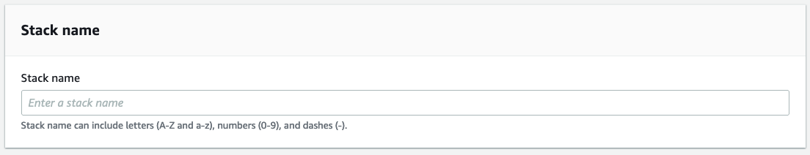

# MLOps Deployment Patterns Pipeline

## Purpose

Use this template to automate the entire model lifecycle that includes both model building and deployment workflows. Ideally suited for continuous integration and continuous deployment (CI/CD) of ML models. Process data, extract features, train and test models, and register them in the model registry. The template provisions an AWS CodeCommit repository for checking in and managing code versions. Kick off the model deployment workflow by approving the model registered in the model registry for deployment either manually or automatically. You can customize the seed code and the configuration files to suit your requirements. AWS CodePipeline is used to orchestrate the model deployment. Model building pipeline: SageMaker Pipelines Code repository: AWS CodeCommit Orchestration: AWS CodePipeline

This project is derived from the built-in [Build, Train, and Deploy Project](https://docs.aws.amazon.com/sagemaker/latest/dg/sagemaker-projects-templates-sm.html#sagemaker-projects-templates-code-commit) but provides the ability to use advanced deployment options including canary and linear deployments. Please reference [this blog](https://aws.amazon.com/blogs/machine-learning/take-advantage-of-advanced-deployment-strategies-using-amazon-sagemaker-deployment-guardrails/) for an overview about how canary and linear deployments are handled by deployment guardrails in Amazon SageMaker Endpoints.

## Instructions

### Part 1: Create initial Service Catalog Product

1. To create the Service Catalog product for this project, download the `create-mlops-deployment-pattern-product.yaml` and upload it into your CloudFormation console: https://console.aws.amazon.com/cloudformation/home?#/stacks/create/template

2. Update the Parameters section:

    - Supply a unique name for the stack

        

    - Enter your Service Catalog portfolio id, which can be found in the __Outputs__ tab of your deployed portfolio stack or in the Service Catalog portfolio list: https://console.aws.amazon.com/servicecatalog/home?#/portfolios

        

    - Update the Product Information. The product name and description are visible inside of SageMaker Studio. Other fields are visible to users that consume this directly through Service Catalog. 

    - Support information is not available inside of SageMaker Studio, but is available in the Service Catalog Dashboard.

    - Updating the source code repository information is only necessary if you forked this repo and modified it.

        

3. Choose __Next__, __Next__ again, check the box acknowledging that the template will create IAM resources, and then choose __Create Stack__.

4. Your template should now be visible inside of SageMaker Studio.

### Part 2: Deploy the Project inside of SageMaker Studio

1. Open SageMaker Studio and sign in to your user profile.

1. Choose the SageMaker __components and registries__ icon on the left, and choose the __Create project__ button.

1. The default view displays SageMaker templates. Switch to the __Organization__ templates tab to see custom project templates.

1. The template you created will be displayed in the template list. (If you do not see it yet, make sure the correct execution role is added to the product and the __sagemaker:studio-visibility__ tag with a value of __true__ is added to the Service Catalog product).

1. Choose the template and click Select the correct project template.

    

6. Fill out the required fields for this project.

    - __Name:__ A unique name for the project deployment.

    - __Description:__ Project description for this deployment.

7. Choose __Create Project__.

    

8. After a few minutes, your example project should be deployed and ready to use.

### Part 3: Update Necessary IAM Permissions for Using CloudWatch with Deployment Guardrails

1. Navigate to the `AmazonSageMakerServiceCatalogProductsUseRole` role (or whichever role you are using for deployments) in the AWS console [here](https://console.aws.amazon.com/iamv2/home?#/roles/details/AmazonSageMakerServiceCatalogProductsUseRole?section=permissions)

1. Chose "Add Permissions" and "Attach Policy"

1. Search for the "CloudWatchFullAccess" policy

1. Select this policy and click "Attach Policy"
