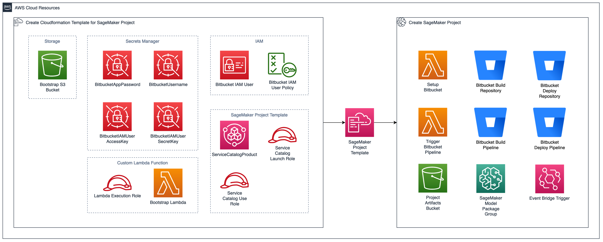
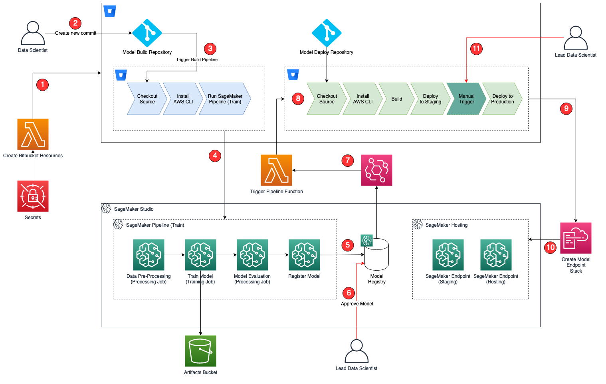

# SageMaker Projects MLOps Template with Bitbucket and Bitbucket Pipelines

The MLOps template in this repo can be used to setup a SageMaker Project for model training and deployment using Bitbucket for SVC and Bitbucket Pipelines for CI/CD. 

## Architecture Diagram

Following resources will be created once you deploy the CloudFormation template: `create-mlops-bitbucket-product.yaml`

#### User Journey

When a Data Scientist creates a SageMaker Project from SageMaker Studio the resources mentioned in diagram above will be created and the following journey will begin:
1. Custom Lambda function will be executed that creates the Bitbucket resources in your Bitbucket Workspace
    - Model Build Repository
    - Model Deploy Repository
    - Bitbucket Build Pipeline
    - Bitbucket Deploy Pipeline
    - Bitbucket Respository Variables
2. A Data Scientist clones the model build repository in __SageMaker Studio__ and make changes to the seed code and commits.
3. Once a commit is created and pushed to the repository, the associated Bitbucket Pipeline defined in `bitbucket-pipelines.yaml` will begin to execute.
4. The Bitbucket build pipeline will create a __SageMaker Pipeline__ and start its execution.
5. After the __SageMaker Pipeline__ completes the execution, a model will be registered under the __Model Package Group__ for the project in __SageMaker Model Registry__.
6. The Lead Data Scientist (or the Technical Lead/Project Owner) can approve this model if the evaluation criteria is fulfilled.
7. As soon as the model is approved, using the __Event Bridge__ rule, a __Lambda__ function is triggered. The Lambda function intiates the Bitbucket deploy pipeline in model deploy repository.
8. Bitbucket deploy pipeline reads the latest configuration and builds a __CloudFormation__ Stack for deployment in Staging and Production.
9. Staging __CloudFormation__ Stack gets deployed with the latest configuration.
10. The model is deployed at a __SageMaker Endpoint__ and __Model Registry__ is updated with the new stage.
11. After obtaining confident results in staging environment, the Lead Data Scientist (Technical Lead/Project Owner) can manually approve the step in Bitbucket deploy pipeline to deploy the __CloudFormation__ Stack for deployment in production environment.

## Instructions

### Pre-requisites

- Permissions to create workspace, project and repositories in Bitbucket
- Permissions to create CloudFormation and Service Catalog resources
- A workspace in Bitbucket
- A portfolio in Service Catalog. You can create one at https://console.aws.amazon.com/servicecatalog/home?#/portfolios. Make sure you provide proper access under __Access__ tab to this portfolio. You can add the execution role of your SageMaker Studio user-profile to begin with.

### Part 1: Create initial Service Catalog Product

1. To create the Service Catalog product for this project, download the `create-mlops-bitbucket-product.yaml` and upload it into your CloudFormation console: https://console.aws.amazon.com/cloudformation

2. Update the Parameters section:

    - Supply a unique name for the stack
    - Enter the Service Catalog portfolio id obtained from previous step. The new product created will be associated with this portfolio.
    - Update the Product Information. The product name and description are visible inside of SageMaker Studio. Other fields are visible to users that consume this directly through Service Catalog. 
    - Support information is not available inside of SageMaker Studio, but is available in the Service Catalog Dashboard.
    - Updating the source code repository information is only necessary if you forked this repo and modified it.
    - Provide the Bitbucket API URL (typically: https://api.bitbucket.org/2.0)
    - Provide your username to be used for authentication in Bitbucket
    - Create and provide Bitbucket App Password to be used for authentication. Read more here: https://support.atlassian.com/bitbucket-cloud/docs/app-passwords/

3. Choose __Next__, __Next__ again, check the box acknowledging that the template will create IAM resources, and then choose __Create Stack__.

4. Your template should now be visible inside of SageMaker Studio.

### Part 2: Deploy the Project inside of SageMaker Studio

1. Open SageMaker Studio and sign in to your user profile.

1. Choose the SageMaker __Home__ icon on the left, and under __Deployments__ choose __Projects__, in the new tab, click the __Create project__ button on top right side.

1. The default view displays SageMaker templates. Switch to the __Organization__ templates tab to see custom project templates.

1. The template you created will be displayed in the template list. (If you do not see it yet, make sure the correct execution role is added to the product and the __sagemaker:studio-visibility__ tag with a value of __true__ is added to the Service Catalog product).

1. Choose the template and click Select the correct project template.

6. Fill out the required fields for this project.

    - __Name:__ A unique name for the project deployment.

    - __Description:__ Project description for this deployment.

    - __Model Build Repository Name__: GitLab Repository where model build code resides

    - __Model Deploy Repository Name__: GitLab Repository where model deploy code resides

    - __Workspace Name:__ Name for the Bitbucket workspace to use.

7. Choose __Create Project__.

8. After a few minutes, your example project should be deployed and ready to use.

### Part 4: Post Project Deployment

Once the project has been created, navigate to your Bitbucket account and you will see 2 new repositories. Clone these repositories in SageMaker Studio. These repositories will have the SageMaker Project Name appended to the name provided while creating the template, this is to prevent project failure due to duplicate project creation attempts.

Each repository will have a Bitbucket Pipeline associated with it that will run as soon as there is a commit to the repository.

Once you clone the model-build repository in SageMaker Studio, navigate to `pipelines -> abalone -> pipeline.py`, here you can modify the code such as changing the default value for `processing_instance_type`. Then commit and push the code to trigger the pipeline, this will result in a new execution for SageMaker Pipeline.

### Part 5: Model Deployment

Once the SageMaker Pipeline to train the model completes, a model will be added to the SageMaker Model Registry. Navigate from __Home__ -> __Models__ -> __Model Registry__ to update the status of newly registered model, here you can approve or reject the model. If that model is approved, the Bitbucket Pipeline in the model deploy repository will start and the model deployment process will begin. 
A SageMaker Endpoint will be created with the suffix `-staging`. A manual step in the Bitbucket Pipeline is present to create an endpoint with the suffix `-production`.