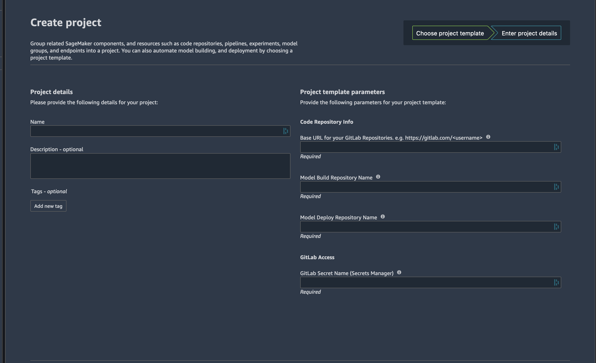

# SageMaker Projects MLOps Template with GitLab and GitLab Pipelines

The MLOps template in this repo can be used to setup a SageMaker Project for model training and deployment using GitLab for SVC and GitLab Pipelines for CI/CD. 

### Prerequisites
The following steps need to be complete before creating a SageMaker Project. 
1. Create a token in GitLab that will be used by the Lambda function defined in `lambda_functions/lambda-seedcode-checkin-gitlab` to create 2 repositories in GitLab populated with seed code for model building and model deployment. 
2. Create a secret in AWS SecretsManager with that token, the secret name will be passed to the project template from SageMaker Studio when it is created.  
3. Upload the zip files in this repository to an S3 bucket that can be accessed by the Project. The 4 zip files to upload are
    1. `zip_files/lambda-seedcode-checkin-gitlab.zip`
    2. `zip_files/lambda-seedcode-checkin-gitlab.zip`
    3. `zip_files/mlops-gitlab-project-seedcode-model-build.zip`
    4. `zip_files/mlops-gitlab-project-seedcode-model-deploy.zip`
4. Use `init.sh` to zip these files and upload them to S3. Pass command line arguments for the S3 bucket name, secret name, and secret token for GitLab so that the Secrets Manager key can be created. 
5. Create an IAM user for GitLab. This user will be used by GitLab Pipelines when interacting with SageMaker APIs. Take note of the AWS Access Key and Secret Key. This will be used in subsequent steps. 
6. **Replace `<AWS_BUCKET>` in `project.yml` with the name of the bucket the zip files were uploaded to.**

### Create an Amazon ServiceCatalog Product
Using the project template defined in `project.yml`, a product in ServiceCatalog needs to be created. Follow the steps in the main repository readme file to create a custom project. 

### Create the Project in SageMaker

Under `Organization Templates` in the SageMaker Project tab, click on the Project you created for GitLab. Enter the details required.

Once the project has been created, navigate to your GitLab account and you will see 2 new repositories. Clone these repositories in SageMaker Studio. These repositories will have the SageMaker Project ID appended to the name provided while creating the template, this is to prevent project failure due to duplicate project creation attempts. 

Each repository will have a GitLab CI Pipeline associated with it that will run as soon as the project is created. The first run of each pipeline will fail because GitLab does not have the AWS credentials. 

For each repository, navigate to Settings -> CI/CD -> Variables.
Create 2 new variables - `AWS_ACCESS_KEY_ID` and `AWS_SECRET_ACCESS_KEY` with the associated information for your GitLab role.

Trigger the pipeline in the model build repository to start a SageMaker Pipeline execution to train your model. 

### Model Deployment

Once the SageMaker Pipeline to train the model completes, a model will be added to the SageMaker Model Registry. If that model is approved, the GitLab Pipeline in the model deploy repository will start and the model deployment process will begin. 
A SageMaker Endpoint will be created with the suffix `-staging`. A manual step in the GitLab Pipeline is present to create an endpoint with the suffix `-production`. 