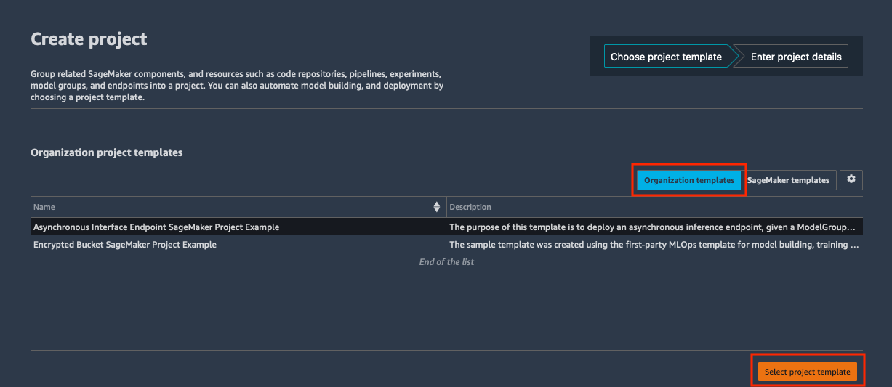

# SageMaker Projects MLOps Template with GitLab and GitLab Pipelines

The MLOps template in this repo can be used to setup a SageMaker Project for model training and deployment using GitLab for SVC and GitLab Pipelines for CI/CD. 

## Instructions

### Part 1: Create initial Service Catalog Product

1. To create the Service Catalog product for this project, download the `create-mlops-gitlab-product.yaml` and upload it into your CloudFormation console: https://console.aws.amazon.com/cloudformation

2. Update the Parameters section:

    - Supply a unique name for the stack

        

    - Enter your Service Catalog portfolio id, which can be found in the __Outputs__ tab of your deployed portfolio stack or in the Service Catalog portfolio list: https://console.aws.amazon.com/servicecatalog/home?#/portfolios

        

    - Update the Product Information. The product name and description are visible inside of SageMaker Studio. Other fields are visible to users that consume this directly through Service Catalog. 

    - Support information is not available inside of SageMaker Studio, but is available in the Service Catalog Dashboard.

    - Updating the source code repository information is only necessary if you forked this repo and modified it.

        

3. Choose __Next__, __Next__ again, check the box acknowledging that the template will create IAM resources, and then choose __Create Stack__.

4. Your template should now be visible inside of SageMaker Studio.

### Part 2: Post Product Setup

Edit the Secrets Manager https://console.aws.amazon.com/secretsmanager/home secret generated by the product, and enter 
The following steps need to be complete before creating a SageMaker Project. 
1. Create a token in GitLab that will be used by the Lambda function defined in `lambda_functions/lambda-seedcode-checkin-gitlab` to create 2 repositories in GitLab populated with seed code for model building and model deployment.
2. Edit the Secrets Manager Secret generated by the product, and with that token. The secret name should be in the format `SageMaker-Projects-GitLab-Token-xxxxxxx`.
3. While in Secrets Manager, note the additional secrets with the Access Key and Secret Key created for the GitLab integration. They can be found in the `SageMaker-Projects-GitLab-UserAccessKey-xxxxxxx` and `SageMaker-Projects-GitLab-UserSecretKey-xxxxxxx` secrets.

### Part 3: Deploy the Project inside of SageMaker Studio

1. Open SageMaker Studio and sign in to your user profile.

1. Choose the SageMaker __components and registries__ icon on the left, and choose the __Create project__ button.

1. The default view displays SageMaker templates. Switch to the __Organization__ templates tab to see custom project templates.

1. The template you created will be displayed in the template list. (If you do not see it yet, make sure the correct execution role is added to the product and the __sagemaker:studio-visibility__ tag with a value of __true__ is added to the Service Catalog product).

1. Choose the template and click Select the correct project template.

    

6. Fill out the required fields for this project.

    - __Name:__ A unique name for the project deployment.

    - __Description:__ Project description for this deployment.

    - __GitLab Server URL:__ URL to your GitLab Server

    - __Base URL:__ the fully qualified URL to the base of your GitLab repositories

    - __Model Build Repository Name__: GitLab Repository where model build code resides

    - __Model Deploy Repository Name__: GitLab Repository where model deploy code resides

    - __GitLab Group ID:__ ID for the GitLab group to use, enter `None` if using the root group

7. Choose __Create Project__.

    

8. After a few minutes, your example project should be deployed and ready to use.

### Part 4: Post Project Deployment

Once the project has been created, navigate to your GitLab account and you will see 2 new repositories. Clone these repositories in SageMaker Studio. These repositories will have the SageMaker Project ID appended to the name provided while creating the template, this is to prevent project failure due to duplicate project creation attempts.

Each repository will have a GitLab CI Pipeline associated with it that will run as soon as the project is created. The first run of each pipeline will fail because GitLab does not have the AWS credentials.

For each repository, navigate to Settings -> CI/CD -> Variables. Create 2 new variables - AWS_ACCESS_KEY_ID and AWS_SECRET_ACCESS_KEY with the associated information for your GitLab role.

Trigger the pipeline in the model build repository to start a SageMaker Pipeline execution to train your model.

### Part 5: Model Deployment

Once the SageMaker Pipeline to train the model completes, a model will be added to the SageMaker Model Registry. If that model is approved, the GitLab Pipeline in the model deploy repository will start and the model deployment process will begin. 
A SageMaker Endpoint will be created with the suffix `-staging`. A manual step in the GitLab Pipeline is present to create an endpoint with the suffix `-production`. 