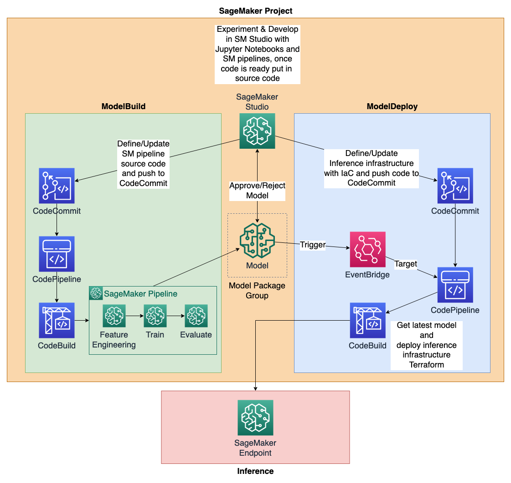

## MLOps Terraform Template for SageMaker Projects

An important aspect of Machine Learning (ML) projects is the transition from the manual experimentation with
Jupyter notebooks and similar to an architecture, where workflows for building, training, deploying and maintaining ML models
in production are automated and orchestrated. In order to achieve this, an operating model between different personas such as Data Scientists,
Data Engineers, ML Engineers, DevOps Engineers, IT and business stakeholders needs to be established. Further, the data and
model lifecycle and the underlying workflows need to be defined, as well as the responsibilities of the different personas
in these areas. This collection of practices is called Machine Learning Operations (MLOps).

This repository contains a set baseline infrastructure for an MLOps environment on AWS for a single AWS account at this moment.
The infrastructure is defined with Terraform and is built around the Amazon SageMaker service.

The 3 main components in the repository are:

### Component 1: ./mlops_infra:

This terraform project is used to bootstrap an account for ML and includes the following modules:
- modules/networking: Deploy vpc, subnet & vpc endpoints for SageMaker
- modules/code_commit: Deploy codecommit repository & associate it as SageMaker repository
- modules/kms: Deploy KMS key for encryption of SageMaker resources
- modules/iam: Deploy Sagemaker roles & policies
- modules/sagemaker_studio: Deploy SageMaker Studio with users and default Jupyterhub app, as well as enabling SageMaker projects

### Component 2: ./mlops_templates:

This terraform project is used to bootstrap service catalog with a portfolio and example terraform based SageMaker project.
It allows deploying many different organizational SageMaker project templates.

- modules/sagemaker_project_template: Create Service Catalog Portolio & products

### Component 3: ./mlops_templates/templates/mlops_terraform_template/seed_code

These folders contain the "seed code", which is the code that will be initialized when a new SageMaker project is created in SageMaker Studio.
The seed code is associated with the corresponding template in the mlops_template code. The seed code should be 100% generic
and should provide the baseline for new ML projects to build on.

- seed_code/build_app: Example terraform based model build application using SageMaker Pipelines, Codecommit & Codebuild
- seed_code/deploy_app: Example terraform based model deployment application that deploys trained models to SageMaker endpoints

## Prerequisites

- Terraform
- Git
- AWS CLI v2

## Architecture overview and workflows

## How to use

### Step 1: Deploy mlops_infra into a fresh account

Navigate to the 'mlops_infra' directory with `cd mlops_infra` and follow instructions:
[mlops_infra](mlops_infra/README.md)

### Step 2: Deploy mlops_template into the same account

Navigate to the 'mlops_templates' directory with `cd mlops_templates` and follow instructions:
[mlops_templates](mlops_templates/README.md)
