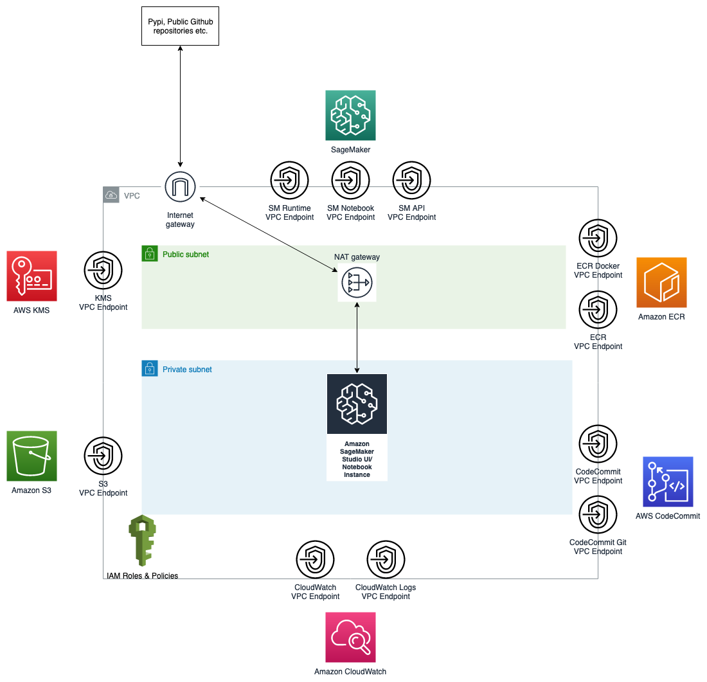

# mlops_infra

## Summary

This repository is used to deploy the foundational infrastructure for MLOps on AWS using Terraform. It includes the modules to deploy:

- `networking`: Sets up basic VPC and Subnets and required VPC Endpoints for running SageMaker Studio in private subnets
- `iam`: Sets up basic IAM roles and IAM policies
- `kms`: Creates KMS key and policies
- `sagemaker_studio`: Deploys and configures Amazon SageMaker Studio including automatically enabling Amazon SageMaker projects

## Architecture overview



## Getting started


How to apply the resources:

Expose aws credentials via environment variables(https://registry.terraform.io/providers/hashicorp/aws/latest/docs#environment-variables)


Create state bucket via CloudFormation & generate terraform/provider.tf, as well as initializing Terraform
```bat
make bootstrap
make init
```

Modify the locals in `terraform/main.tf`. In particular, change the `prefix` to a unique name for your project/use-case. This will allow deploying multiple versions of the infrastructure side by side for each prefix.

## Deploying your infrastructure

```bat
make plan
make apply
```

## Adding new users to Amazon SageMaker Studio Domain

To add additional users to the Amazon SageMaker Studio domain

1. Open `terraform/main.tf`
2. Modify the user list
3. `make plan && make apply`

## How to destroy the resources:

```bat
make destroy
```

> Note: For the SageMaker Studio related resources (e.g. User etc.) you need to currently do it manually, as the destroy command fails with the user still being in use.