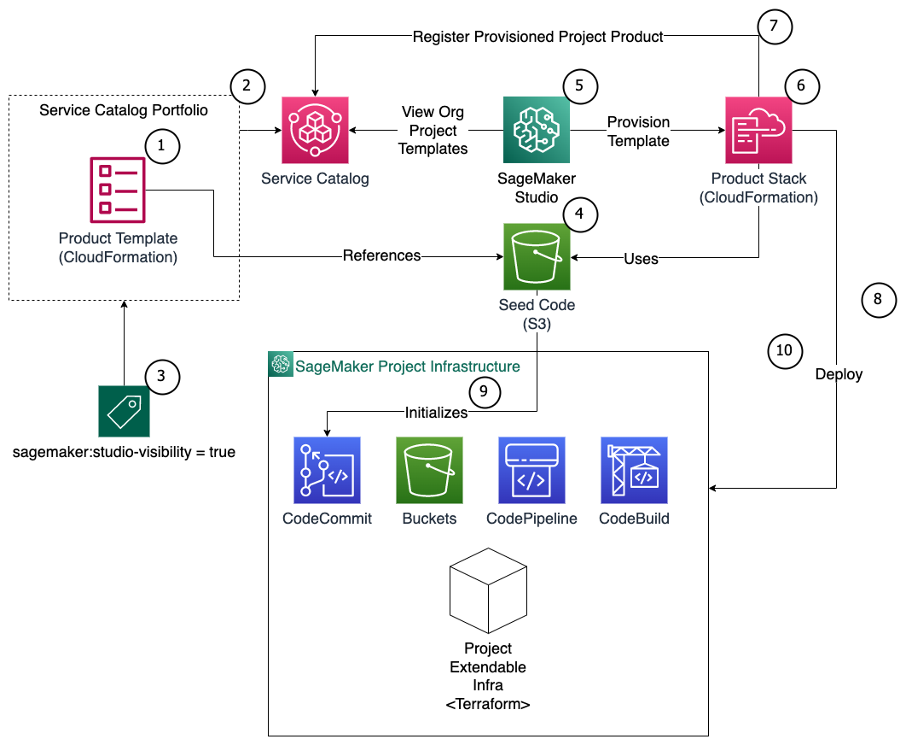

# mlops_templates

## Summary

This repository deploys the Amazon SageMaker Studio Project Templates into your account and makes them accessible via 
the Organizational Templates in SageMaker Studio. 

## Architecture overview



# Getting started

## 1. Deploying your templates

Modify the locals in `terraform/main.tf` as required. In particular, change the `prefix` to a unique name for your project/use-case. 
This will allow deploying multiple versions of the infrastructure side by side for each prefix (e.g. different regions).
Bootstrapping and generate terraform/provider.tf, as well as initializing Terraform and modules:

```bat
make bootstrap
make init
```

Deploy service catalog portfolio product & enable the SageMaker Project template for use in SageMaker Studio.

```bat
make plan
make apply
```

### Extending Templates

The code that would be copied when you initialize a new SageMaker Project can be found in `terraform/templates`. When a new SageMaker project is initialized, the code from `terraform/templates` will be copied into new CodeCommit repositories and linked to the project. It is possible to modify these base templates to fit your organizational needs. 

It is also possible to add your own templates. If you add your own templates, ensure you configure them to be deployed in `terraform/main.tf`.


## 2. Creating a new SageMaker Project based on the template & Bootstrap

1. Open AWS Console
2. Go to Amazon SageMaker -> Control Panel -> Your User --> Launch App --> Studio
3. Wait for Amazon SageMaker Studio to launch
4. In the left bar -> SageMaker Resources -> In the drop down tab select Projects
5. Click "Create project"
6. Select the "Organization templates" tab
7. Select the "mlops_terraform_template & click on "Select project template" 
    - Note: Your template name might be different if you used a different prefix. 
8. Enter a unique project name and the required fields
9. Click "Create"
10. Wait for the SageMaker Project instance to be created from the template 
11. Open project by double clicking -> Repositories Tab
12. Click Clone Repository (for both)

After a new project has been created. It needs to be bootstrapped:

- Top Menu: Git -> Open a Terminal in SageMaker Studio and navigate to the modelbuild Git repository
- `$ make bootstrap` # tap enter for the defaults
- In case you get a permission denied error, consider using the command `chmod u+x ./infra_scripts/bootstrap.sh`
- Ensure entries are correct and complete after bootstrapping process. This will generate terraform/provider.tf & terraform/terraform.tfvars files and install Terraform
- `$ make init`
- `$ make plan`
- `$ make apply` # Deploys CICD pipeline for building models and running sagemaker pipelines on new commits
- `$ git add -A`
- `$ git commit -m "bootstrapped"`
- `$ git push` # Will trigger CodePipeline & deploy/train SageMaker pipeline
- Approve the resulting model in SageMaker Studio under Model Groups of the SageMaker Project


## 3. Create Inference Infrastructure based on your trained model
- Navigate to the modeldeploy repository in the terminal window of SageMaker Studio to deploy your infra related infrastructure:
- `$ make bootstrap`
- Ensure entries are correct and complete after bootstrapping process. This will generate terraform/provider.tf & terraform/terraform.tfvars files and install terraform
- `$ make init`
- `$ make plan`
- `$ make apply`