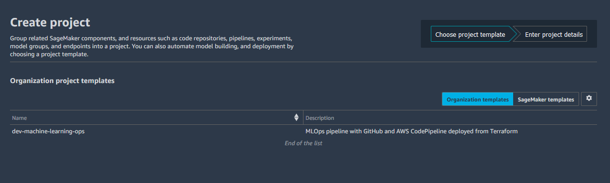
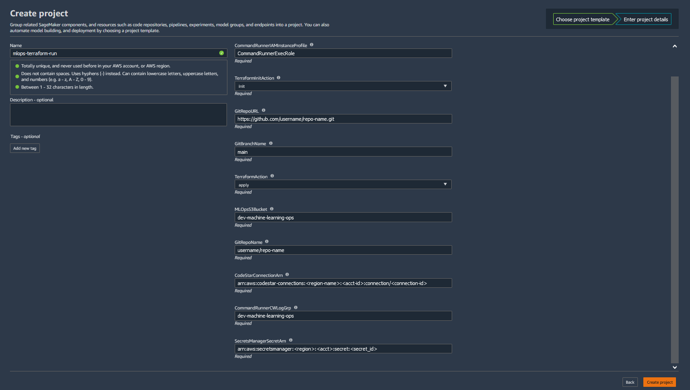

# Amazon SageMaker Project with Terraform

This section of the repository contains steps to set up Amazon SageMaker Project from Terraform.

[A SageMaker Project] (https://docs.aws.amazon.com/sagemaker/latest/dg/sagemaker-projects-whatis.html) helps organizations set up and standarize environments for automating different steps involved in a Machine Learning Lifecycle.

While notebooks are helpful for model building and experimentation, a team of data scientists and ML engineers sharing code needs a more scalable way to maintain code consistency and strict version control.

Amazon SageMaker provides a set of first-party templates for organizations that want to quickly get started with ML workflows and CI/CD. The templates include projects that use AWS-native services for CI/CD, such as AWS CodeBuild, AWS CodePipeline, and AWS CodeCommit. For more information about SageMaker-Provided Templates refer to this [link](https://docs.aws.amazon.com/sagemaker/latest/dg/sagemaker-projects-templates-sm.html).

SageMaker Projects can support custom template offerings where organizations use AWS CloudFormation templates and Terraform to define the resources needed for an ML workflow. 

In this section of this repository we will take a look how we can set up an Amazon SageMaker Project to automate and standardize the different steps involved in a Machine Learning Lifecycle by integrating with Terraform.

## Architecture Diagram

 

### Architecture Overview:

* In this example, the ML code will be hosted in a GitHub Repository.
* Everytime a Git Push is performed in this repository, it will trigger a Machine Learning Pipeline orchestrated by the AWS CodePipeline.
* Different steps within the AWS CodePipeline will be execute within an AWS CodeBuild project.
* These steps part of the ML workflow will be represented within an Amazon SageMaker feature called as the SageMaker Pipelines.
* This SageMaker Pipeline is a series of interconnected steps encoded using a directed acyclic graph (DAG).
* DataScientists can review these SageMaker Pipelines in Amazon SageMaker Studio within the SageMaker Project.
* SageMaker Project also contains other ML workflow components like Experiments, ML repositories, Model Groups, Endpoints etc all in one place for an holistic overview of maintaining a standardized Machine Learning Workflow.

### Repository Overview:
* This repository two different packages of Terraform Code:

    * First package is for the [AWS Service Catalog Set Up ](../../tree/main/service-catalog-setup)
        - This has the terraform code to provision all the AWS Cloud Infrastructure required to create the SageMaker project.
        - At a high level those resources are:
            - Service Catalog resources.
            - S3 Bucket to store the backend state of the SageMaker Project infrastructure.
            - AWS IAM resources.
            - DynamoDB table for backend state of the SageMaker Project infrastructure. 
            - CloudWatch Log group.
            - Secrets Manager secret to store the GitHub Credentials.
            
    * Second package is for the [Amazon SageMaker Project Set Up] (../../tree/main/sagemaker-project-setup)
        - This has the terraform code to provision Machine Learning Pipeline resources associated with the SageMaker project.
        - At a high level those resources are:
            - AWS CodePipeline for the ML workflow.
            - AWS CodeBuild resources for this CodePipeline.
            - S3 bucket to store the ML artifacts
            - AWS Lambda function and CodeBuild resources to push a sample ML seed code to the GitHub ML repo.

### Integration between Amazon SageMaker Project and Terraform

* To create a SageMaker Project, you have to he select a template suited for your ML workflow. It can be a SageMaker provided templates or Custom Templates as explained earlier.
* In this example, you will be selected a Custom template that is provisioned by the First Terraform package as explained in the Repository overview.
* When you create the SageMaker project using this custom template, it will launch a Service Catalog product associated with the template.
* The Service Catalog Product is in turn execute a CloudFormation Stack.
* This CloudFormation Stack will launch only a single resource called as the Command Runner Utility.
* This utility provisions an Amazon EC2 instance and runs the Second Terraform package mentioned in the Repository overview section to create the ML pipeline resources required for the SageMaker project.
* CloudFormation does not launch any other resources. It is only used to run a Command Runner Utility to perform the execution of the Terraform code.
* Once the Terraform execution is complete, the CloudFormation Stack status changes to complete and the Amazon EC2 instance launched from the CommandRunner utility is terminated.

## Instructions

### Step 1: Create AWS CodeStar Connection for GitHub Integration

1. In this example we will be using GitHub as the Source Code repository to store our Machine Learning Code.
2. We will use AWS CodeStar service to set up the GitHub repo connection with AWS.
3. Follow the instructions provided [in this link for the CodeStart Connection](https://docs.aws.amazon.com/sagemaker/latest/dg/sagemaker-projects-walkthrough-3rdgit.html#sagemaker-proejcts-walkthrough-connect-3rdgit)
4. Note the AWS CodeStar Connection ARN.
    
### Step 2: Enable CloudFormation CommandRunner Utility in your AWS account

1. As mentioned earlier, we will be using CommandRunner Utility to run the second package of the Terraform Code to provision the ML pipeline resources.
2. CommandRunner is not enabled by default, we will need to register it to start using it.
3. Follow the instructions provided [in this link for the CommandRunner set up] (https://aws.amazon.com/premiumsupport/knowledge-center/cloudformation-commandrunner-stack/)

### Step 3: Terraform Installation.
1. Install Terraform on your development machine. [Reference Link] (https://learn.hashicorp.com/tutorials/terraform/install-cli)

### Step 4: Service Catalog Set up.
1. Clone this GitHub repository. __"git clone https://github.com/aws-samples/sagemaker-custom-project-templates.git"__.
2. Navigate to the "Service Catalog Set up" directory. Run __"cd mlops-tf-pipelines/service-catalog-setup/"__.
3. Update the __"terraform.tfvars"__ file as per your organization environment.
4. Initialize Terraform. Run __"terraform init"__.
5. Generate the Terraform plan. Run __"terraform plan"__.
6. Execute the Terraform code. Run __"terraform apply"__.

### Step 5: Create the Amazon SageMaker Project inside the SageMaker Studio.

1. Open SageMaker Studio and sign in to your user profile.
2. Choose the SageMaker __components and registries__ icon on the left, and choose the __Create project__ button.
3. The default view displays SageMaker templates. Switch to the __Organization__ templates tab to see custom project templates.
4. The template you created will be displayed in the template list. (If you do not see it yet, make sure the correct execution role is added to the product and the __sagemaker:studio-visibility__ tag with a value of __true__ is added to the Service Catalog product).
5. Choose the template and click Select project template.

    

1. Enter a name and optional description for the project. 

    

2. For GitRepoURL, enter the URL of your Git repository for the model build code in https://git-url.git format.
3. For GitBranchName, enter the branch to use from your Git repository for pipeline activities.
4. For MLOpsS3BucketFolder, enter the S3 Bucket created as part of Step1.
5. For GitRepoName, enter the Git repository name in the format of username/repository name or organization/repository name.
6. For Codestar Connection ARN, enter the ARN of the AWS CodeStar connection you created in Step 1.

You have now successfully created an MLOps SageMaker Project with Terraform integration. 