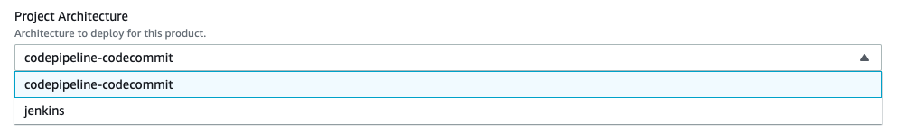
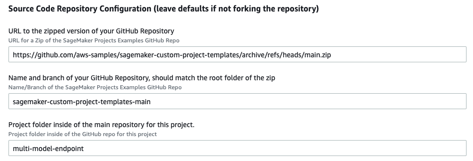
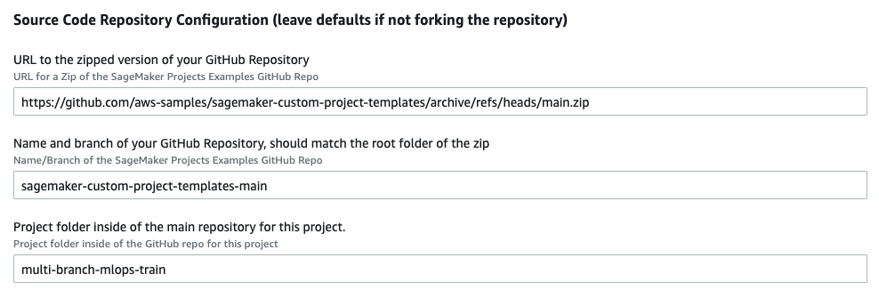

# Multi-Branch MLOps training pipeline

## Purpose

The purpose of this template is to enable multiple data scientists to work in parallel in concurrent experiments without interfering with each other and submitting conflicting changes to the repository.

Much like in the context of software engineering where there is the concept of feature branches and GitFlow, this sample introduces the concept of experiment branches.

Each experiment when submitted to the remote repository by using ``git push`` will trigger a training job that will generate a model artifact tagged with the commit hash and a `Pending` status.

When a pull request gets approved from the ``experiment/<experiment_name>`` branch into `main`, the produced model artifact status gets automatically changed to `Approved`.


## Architecture

There are two architectures available, one using AWS CodePipeline and AWS CodeCommit and another using Jenkins and GitHub.

### AWS CodePipeline and AWS CodeCommit


### Jenkins and GitHub


## Instructions

Part 1: Create initial Service Catalog Product

1. To create the Service Catalog product for this project, download the `create-multi-branch-mlops-product.yaml` and upload it into your CloudFormation console: https://console.aws.amazon.com/cloudformation/home?#/stacks/create/template

2. Update the Parameters section:

    - Choose a deployment type. You have the option to select between the CodeCommit/CodePipeline and the GitHub/Jenkins based implementation.

        

    - Supply a unique name for the stack

        

    - Enter your Service Catalog portfolio id, which can be found in the __Outputs__ tab of your deployed portfolio stack or in the Service Catalog portfolio list: https://console.aws.amazon.com/servicecatalog/home?#/portfolios

        

    - Update the Product Information. The product name and description are visible inside of SageMaker Studio. Other fields are visible to users that consume this directly through Service Catalog. 

    - Support information is not available inside of SageMaker Studio, but is available in the Service Catalog Dashboard.

    - Updating the source code repository information is only necessary if you forked this repo and modified it.

        

3. Choose __Next__, __Next__ again, check the box acknowledging that the template will create IAM resources, and then choose __Create Stack__.

4. Your template should now be visible inside of SageMaker Studio.


Part 2: Deploy the Project inside of SageMaker Studio

1. Open SageMaker Studio and sign in to your user profile.

1. Choose the SageMaker __components and registries__ icon on the left, and choose the __Create project__ button.

1. The default view displays SageMaker templates. Switch to the __Organization__ templates tab to see custom project templates.

1. The template you created will be displayed in the template list. (If you do not see it yet, make sure the correct execution role is added to the product and the __sagemaker:studio-visibility__ tag with a value of __true__ is added to the Service Catalog product).

1. Choose the template and click Select the correct project template.

    

6. Fill out the required fields for this project.

    - __Name:__ A unique name for the project deployment.

    - __Description:__ Project description for this deployment.

7. Choose __Create Project__.

    

8. After a few minutes, your example project should be deployed and ready to use.


### Step 3. Add the sample code to the created repository

Continue from the previously used terminal.

Note that the user or role that is being used must have permission to use CodeCommit, such as the [AWSCodeCommitPowerUser](https://docs.aws.amazon.com/codecommit/latest/userguide/security-iam-awsmanpol.html#managed-policies-poweruser).

```
git init
git stage .
git commit -m "adds sample code"
git remote add origin-aws https://git-codecommit.us-east-1.amazonaws.com/v1/repos/model-myawesomeproject-train
git push --set-upstream origin-aws main
```

## Usage (Creating a new experiment)

### Step 1. Submit experiment code to the repository.

Either clone the CodeCommit repository or start from the previous terminal.

```
git checkout -b experiment/myexperiment
<make some changes to the code>
git commit -m "adds some-change"
git push --set-upstream origin-aws experiment/myexperiment
```

Given a few seconds a new pipeline gets created in AWS CodePipeline.


The `Train` step of the pipeline launches a new AWS SageMaker Pipelines pipeline that trains the model.


When the pipeline finishes, a new model gets stored in SageMaker Model Registry with `Pending` status.


At this point the data scientist can assess the experiment results and push subsequent commits attempting to reach better results for the experiment goal. When doing so, the pipeline will be triggered again and new model versions will be stored in the Model Registry.

If on the other hand, the Data Scientist deems the experiment successful, he can go ahead and create a pull request, asking to merge the changes from the `experiment/myexperiment` branch into `main`.

### Step 2. Open pull request with successful experiment code.


With the pull request created it can be reviewed, not just the code, but the results of the experiment as well.

If all is good, we can merge the pull request in Fast forward-merge.


As soon as the merge is done, the respective model gets automatically approved in the Model Registry.

