# Multi-Branch MLOps training pipeline

## Purpose

The purpose of this template is to enable multiple data scientists to work in parallel in concurrent experiments without interfering with each other and submitting conflicting changes to the repository.

Much like in the context of software engineering where there is the concept of feature branches and GitFlow, this sample introduces the concept of experiment branches.

Each experiment when submitted to the remote repository by using ``git push`` will trigger a training job that will generate a model artifact tagged with the commit hash and a `Pending` status.

When a pull request gets approved from the ``experiment/<experiment_name>`` branch into `main`, the produced model artifact status gets automatically changed to `Approved`.

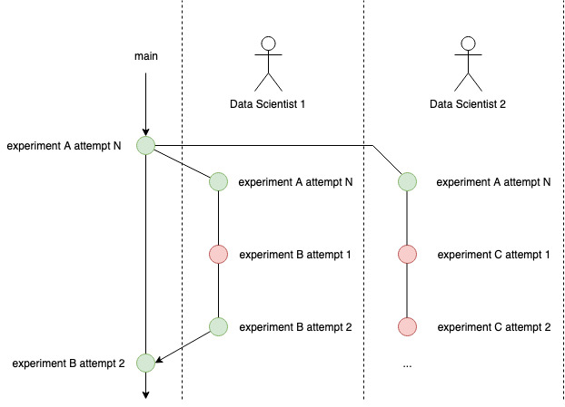

## Architecture

There are two architectures available, one using AWS CodePipeline and AWS CodeCommit and another using Jenkins and GitHub.

### AWS CodePipeline and AWS CodeCommit

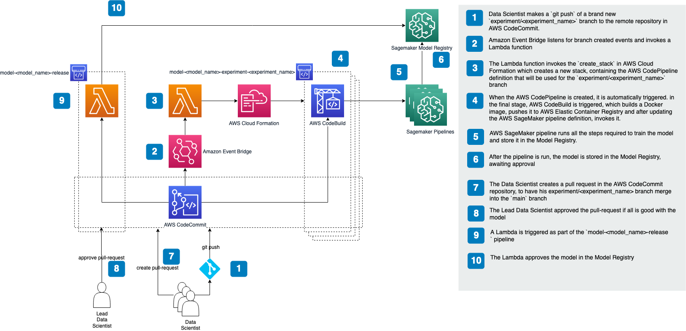

### Jenkins and GitHub

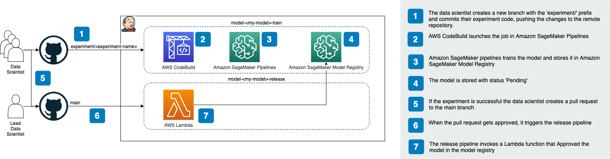

## Usage (Adding the template to Amazon SageMaker Projects in Studio)

### Step 1. Deploy the baseline stack 

```
git clone https://github.com/aws-samples/sagemaker-custom-project-templates.git
mkdir sample-multi-branch-train
cp -r sagemaker-custom-project-templates/multi-branch-mlops-train/* sample-multi-branch-train
cd sample-multi-branch-train
./deploy.sh -p code_pipeline+code_commit
```

In the example above you can also deploy the stack to support Jenkins and GitHub, using `./deploy.sh -p jenkins`.

### Step 2. Create portfolio in AWS Service Catalog

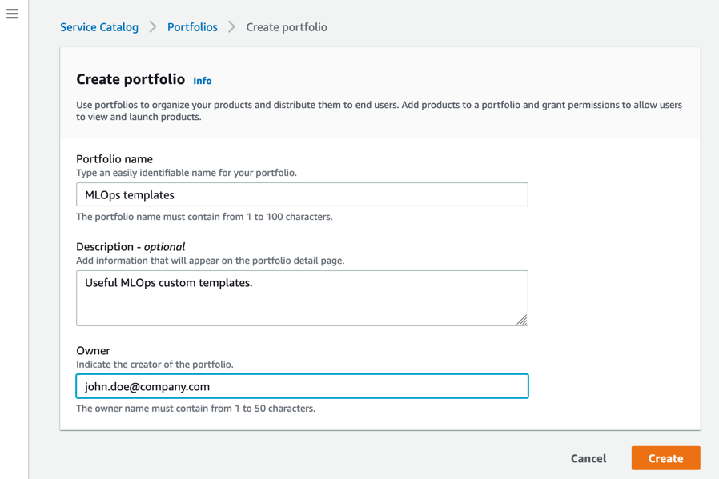

### Step 3. Create a new product for the portfolio

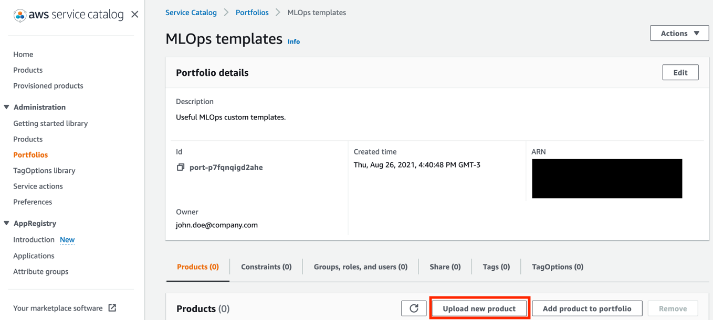

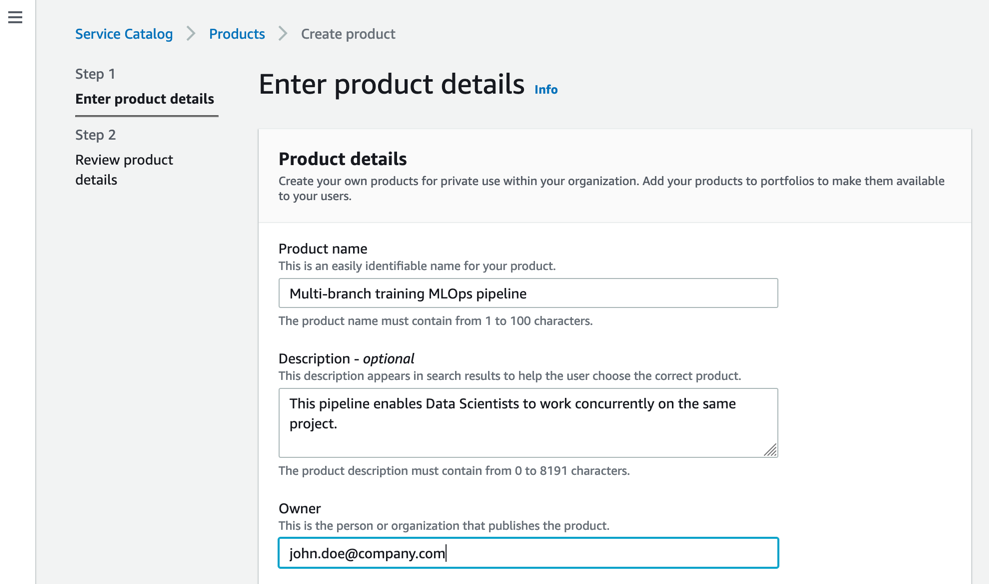

Use the AWS Cloud Formation template deployed by the baseline stack.

`https://cloud-formation-<ACCOUNT-ID>-us-east-1.s3.amazonaws.com/model_train.yaml`

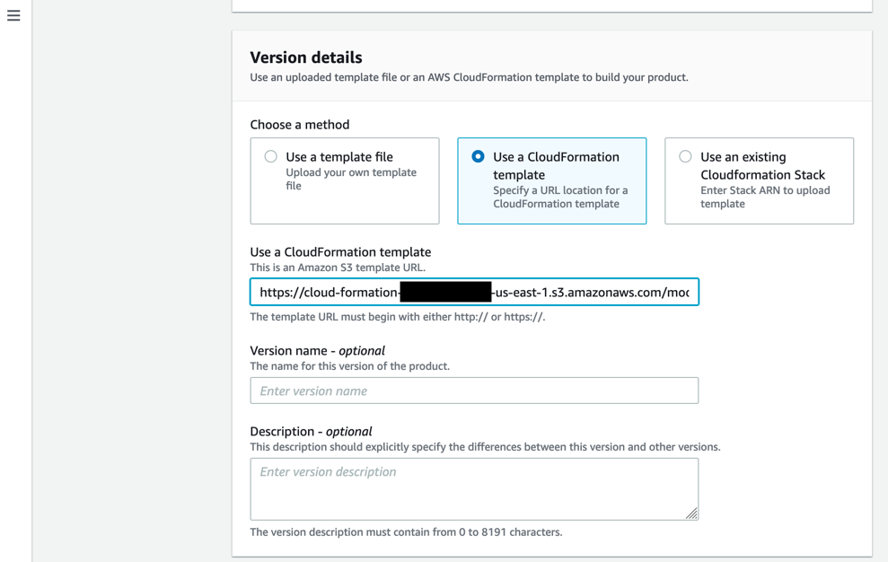

### Step 4. Add SageMaker visibility tag to the product

Tag `sagemaker:studio-visibility` with value `true`.

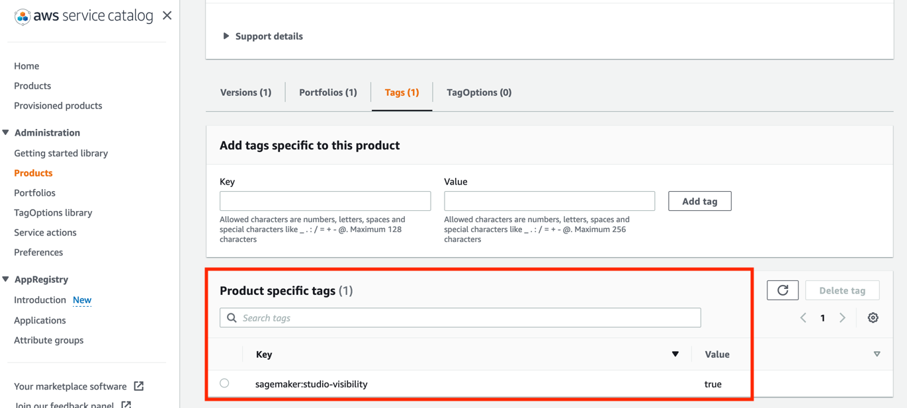

### Step 5. Go to the Portfolio created and add a constraint.

The role `MultiBranchTrainMLOpsLaunchRole` was created by the baseline stack.

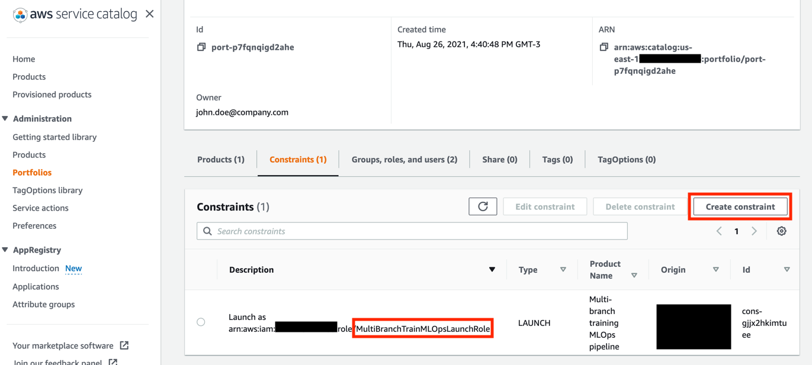

### Step 6. Go to the Portfolio created and share it with the relevant users as well as the SageMaker execution role, used by SageMaker Studio.

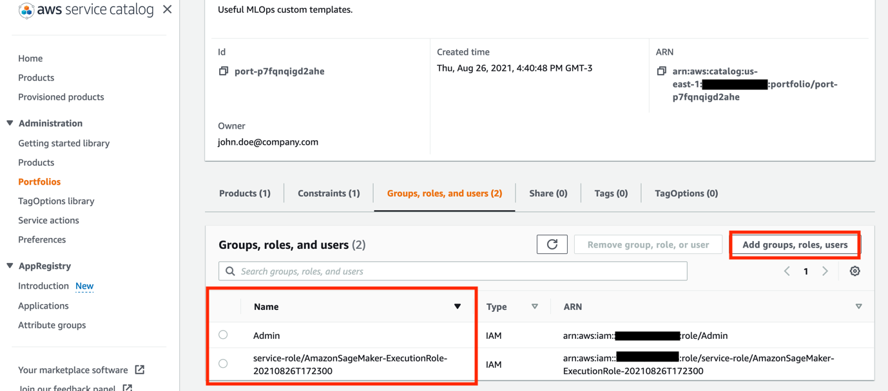

### Step 7. The template becomes available in SageMaker Studio

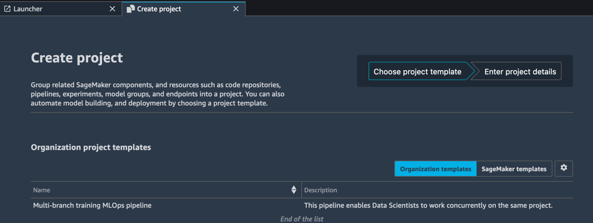

## Usage (Creating a new project)

### Step 1. Select the template in the example above and provide a name.

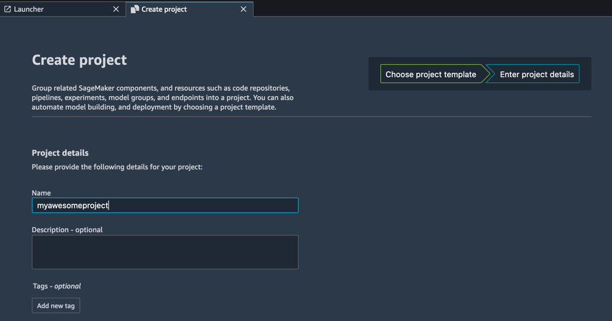

### Step 2. Wait for the project to be created.

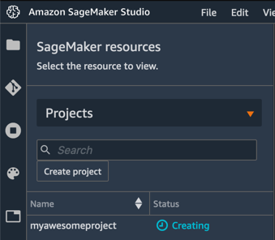

### Step 3. Add the sample code to the created repository

Continue from the previously used terminal.

```
git init
git stage .
git commit -m "adds sample code"
git remote add origin-aws https://git-codecommit.us-east-1.amazonaws.com/v1/repos/model-myawesomeproject-train
git push --set-upstream origin-aws main
```

## Usage (Creating a new experiment)

### Step 1. Submit experiment code to the repository.

Either clone the CodeCommit repository or start from the previous terminal.

```
git checkout -b experiment/myexperiment
<make some changes to the code>
git commit -m "adds some-change"
git push --set-upstream origin-aws experiment/myexperiment
```

Given a few seconds a new pipeline gets created in AWS CodePipeline.

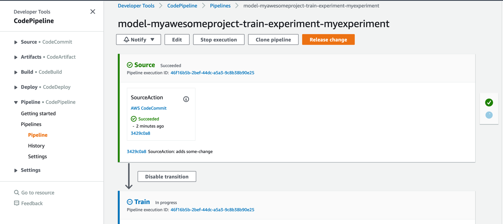

The `Train` step of the pipeline launches a new AWS SageMaker Pipelines pipeline that trains the model.

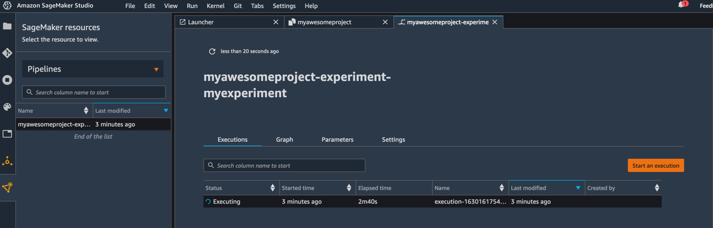

When the pipeline finishes, a new model gets stored in SageMaker Model Registry with `Pending` status.

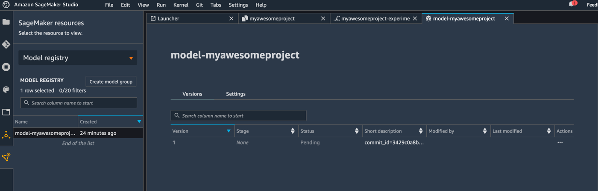

At this point the data scientist can assess the experiment results and push subsequent commits attempting to reach better results for the experiment goal. When doing so, the pipeline will be triggered again and new model versions will be stored in the Model Registry.

If on the other hand, the Data Scientist deems the experiment successful, he can go ahead and create a pull request, asking to merge the changes from the `experiment/myexperiment` branch into `main`.

### Step 2. Open pull request with successful experiment code.

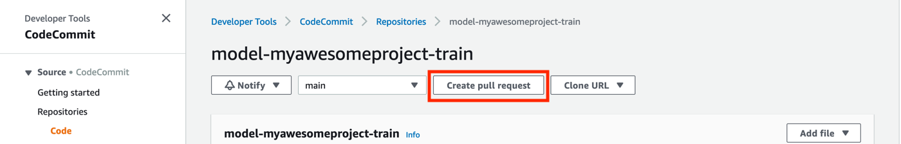

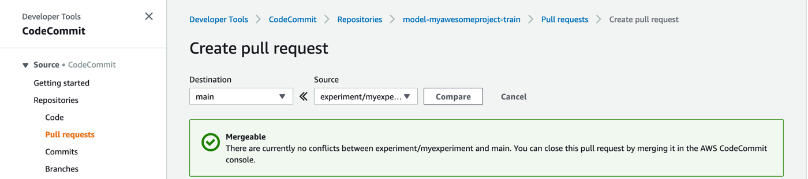

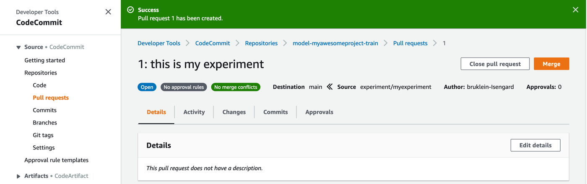

With the pull request created it can be reviewed, not just the code, but the results of the experiment as well.

If all is good, we can merge the pull request in Fast forward-merge.

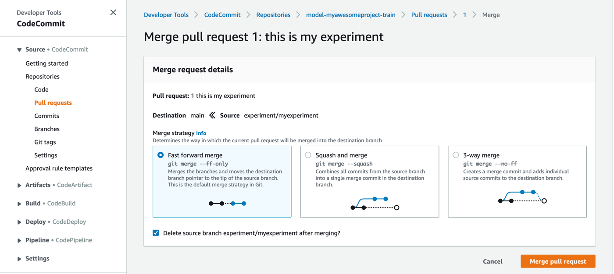

As soon as the merge is done, the respective model gets automatically approved in the Model Registry.

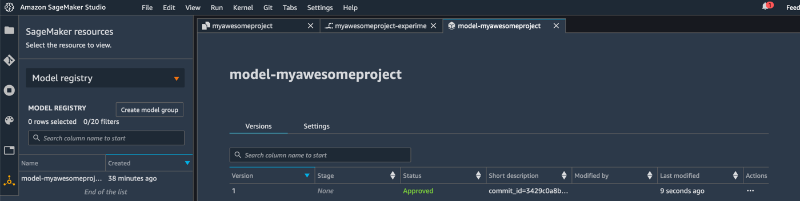