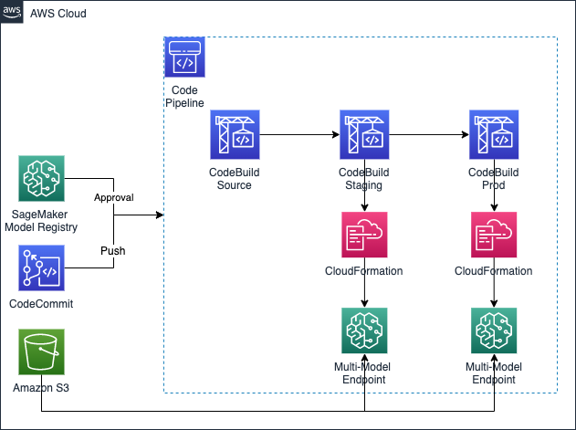

# Multi Model Endpoint Deployment Pipeline

## Purpose

The purpose of this template is to deploy a multi-model inference endpoint. It accepts as input the S3 path where the different models are stored. All of the models need to be at the root of the path provided, and they must all be `.tar.gz` files.

## Architecture

## Instructions

1. Run `sh init.sh <AWS-BUCKET>`
2. Create a Product in Service Catalog using the `template.yml` file as CFN and add the Product to the Portfolio
3. Set the `sagemaker:studio-visibility` tag to `true` in the Product
4. Launch in the SageMaker Projects Organization Templates page