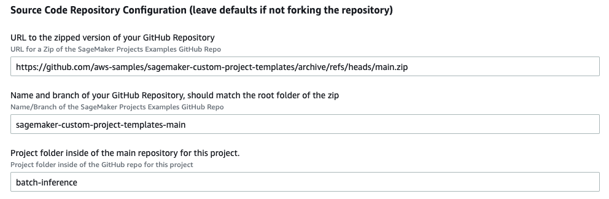

# Multi-model training and batch inference pipeline

## Purpose

The purpose of this template is to deploy a Sagemaker Training Pipeline for parallel training of multiple models, and a scheduled batch inference using SageMaker Batch Transform and SageMaker Pipelines, given two `ModelGroupPackageName` from the Amazon SageMaker Model Registry. 

## Architecture

## Instructions

Part 1: Create initial Service Catalog Product

1. To create the Service Catalog product for this project, download the `create-batch-inference-product.yaml` and upload it into your CloudFormation console: https://console.aws.amazon.com/cloudformation

2. Update the Parameters section:

    - Supply a unique name for the stack

        

    - Enter your Service Catalog portfolio id, which can be found in the __Outputs__ tab of your deployed portfolio stack or in the Service Catalog portfolio list: https://console.aws.amazon.com/servicecatalog/home?#/portfolios

        

    - Update the Product Information. The product name and description are visible inside of SageMaker Studio. Other fields are visible to users that consume this directly through Service Catalog. 

    - Support information is not available inside of SageMaker Studio, but is available in the Service Catalog Dashboard.

    - Updating the source code repository by pointing to the current repo: https://github.com/brunopistone/multi-model-train-template/archive/refs/heads/main.zip

        

3. Choose __Next__, __Next__ again, check the box acknowledging that the template will create IAM resources, and then choose __Create Stack__.

4. Your template should now be visible inside of SageMaker Studio.

Part 2: Deploy the Project inside of SageMaker Studio

1. Open SageMaker Studio and sign in to your user profile.

1. Choose the SageMaker __components and registries__ icon on the left, and choose the __Create project__ button.

1. The default view displays SageMaker templates. Switch to the __Organization__ templates tab to see custom project templates.

1. The template you created will be displayed in the template list. (If you do not see it yet, make sure the correct execution role is added to the product and the __sagemaker:studio-visibility__ tag with a value of __true__ is added to the Service Catalog product).

1. Choose the template and click Select the correct project template.

    

6. Fill out the required fields for this project.

    - __Name:__ A unique name for the project deployment.

    - __Description:__ Project description for this deployment.

    - __SourceModelPackageGroupName:__ The name of the SageMaker Model Registry Model Group that will trigger redeployments via this pipeline. This group can be a pre-existing one, or one that you create later. The name of the group must match the entry to trigger deployment.

7. Choose __Create Project__.

    

8. After a few minutes, your example project should be deployed.

9. Follow the [README](./seedcode/README.md) file for using the code example