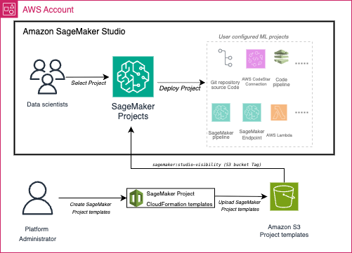

# S3-Based SageMaker AI Project Templates

Deploy custom project templates directly from S3 buckets. AWS now recommends this approach for most use cases.
The latest enhancement allows administrators to store and manage project templates directly in Amazon S3. This means that templates can be versioned, secured, and shared across teams using S3’s access controls and lifecycle management features. Data science teams can now launch new projects from these S3 templates, ensuring consistency and compliance with organizational standards. 

## Overview

S3-based templates provide the recommended approach for custom SageMaker AI projects, offering:

- **Simplified template provisioning** without Service Catalog complexity
- **Direct template management** in S3
- **Faster iteration cycles** for development and testing
- **Flexible template structures** for various use cases
- **Cost-effective** solution for most scenarios




## S3 based template examples 
In this repository we have provided the following SageMaker AI project S3 based template examples. See the setup instructions to get started. 

| # | Sample | Location | Description |
|--------|----------|-------|-----------------|
|1. | Multiple sample templates converted to S3 based SageMaker AI projects | [`sample-templates/`](./sample-templates/) | Multiple existing templates that are converted to S3 based SageMaker AI projects |
|2. | ModelOps with GitHub Actions S3 based SageMaker AI project template | [`mlops-github-actions/`](./mlops-github-actions/) | Complete ModelOps pipeline using GitHub Actions for CI/CD: SageMaker AI Pipelines for model training, GitHub Actions workflows for build and deployment, EventBridge integration for automated deployments, Model Registry approval workflows, Multi-environment deployment (staging/production) |


## Prerequisites

- AWS CLI configured with appropriate permissions
- SageMaker AI Studio domain set up
- S3 bucket for storing templates

## Setup Instructions for S3 based templates

### 0. Set Environment Variables

Set these environment variables to make the following commands reusable.

```bash
export AWS_REGION=$(aws configure get region)    
export AWS_ACCOUNT_ID=$(aws sts get-caller-identity --query Account --output text)
export BUCKET_NAME="sagemaker-projects-templates-${AWS_ACCOUNT_ID}-${AWS_REGION}"
```

### 1. Create S3 Bucket (OPTIONAL)

```bash
aws s3 mb s3://$BUCKET_NAME --region $AWS_REGION
```

### 2. Configure CORS Policy

Create a CORS policy file (`cors-policy.json`):

```json
{
    "CORSRules": [
        {
            "AllowedHeaders": [
                "*"
            ],
            "AllowedMethods": [
                "POST",
                "PUT",
                "GET",
                "HEAD",
                "DELETE"
            ],
            "AllowedOrigins": [
                "https://*.sagemaker.aws"
            ],
            "ExposeHeaders": [
                "ETag",
                "x-amz-delete-marker",
                "x-amz-id-2",
                "x-amz-request-id",
                "x-amz-server-side-encryption",
                "x-amz-version-id"
            ]
        }
    ]
}
```

Apply the CORS policy:

```bash
aws s3api put-bucket-cors --bucket $BUCKET_NAME --cors-configuration file://cors-policy.json
```

### 3. Upload Templates

Upload your template files to the S3 bucket.
This step is for demonstration only, actual templates are provided in each subfolder.

```bash
aws s3 cp templates/your-template.yaml s3://$BUCKET_NAME/templates/
```

### 4. Tag Templates for Visibility

Add the required tag to make templates visible in SageMaker Studio:

```bash
aws s3api put-object-tagging --bucket $BUCKET_NAME --key templates/your-template.yaml --tagging 'TagSet=[{Key=sagemaker:studio-visibility,Value=true}]'
```


### 5. Configure SageMaker AI Studio Domain

Tag your SageMaker AI domain to specify the S3 template location:
```bash
export DOMAIN_ID=$(aws sagemaker list-domains --query 'Domains[0].DomainId' --output text)                  # Your SageMaker domain ID
```

```bash
aws sagemaker add-tags --resource-arn arn:aws:sagemaker:$AWS_REGION:$AWS_ACCOUNT_ID:domain/$DOMAIN_ID --tags Key=sagemaker:projectS3TemplatesLocation,Value=s3://$BUCKET_NAME/templates/
```


### 6. Set Up IAM Roles

SageMaker AI Projects require a set of IAM roles that fall under two categories:

* `Use Roles` – Used within the template by each resource for the required operations. For each operation in the product template, the Use Role is assumed by the respective AWS Service Principal.
* `Launch Role` – Used to define permissions to provision the underlying resources specified by the template. This allows ML engineers and/or data scientists to create projects using templates without needing their SageMaker AI Execution Role to have all the policies necessary. SageMaker AI Projects uses the launch role while creating the project so that the ML engineers and data scientists using the project can have their roles limited to the specific policies they need.

We provide instructions for each custom template that ensures roles and policies to facilitate the deployment of the necessary roles and policies.

**NOTE** - These samples are for demonstration only. Please ensure that the IAM roles and IAM policies are inline with your security requirements.

## Troubleshooting

### Common Issues

**Templates not visible in Studio:**
- Verify the `sagemaker:studio-visibility` tag is set to `true`
- Check CORS policy configuration
- Ensure domain is tagged with correct S3 location

**Permission errors:**
- Verify IAM roles have necessary S3 permissions (commonly the `s3:GetObjectTagging` permission is missing)
- Check SageMaker AI execution role permissions

**Template deployment failures:**
- Review CloudFormation stack events
- Check parameter validation
- Verify resource limits and quotas

### Debugging Commands

Check template tags:
```bash
aws s3api get-object-tagging --bucket $BUCKET_NAME --key templates/template.yaml
```

Verify domain tags:
```bash
aws sagemaker list-tags --resource-arn arn:aws:sagemaker:$AWS_REGION:$AWS_ACCOUNT_ID:domain/$DOMAIN_ID
```

## Migration from Service Catalog

If migrating from Service Catalog templates:

1. Extract CloudFormation template from Service Catalog product
2. Remove Service Catalog-specific metadata
3. Add required SageMaker AI parameters
4. Test in development environment

## Resources

- [SageMaker AI Projects User Guide](https://docs.aws.amazon.com/sagemaker/latest/dg/sagemaker-projects.html)
- [Create Custom Project Templates](https://docs.aws.amazon.com/sagemaker/latest/dg/sagemaker-projects-templates-custom.html)
- [CloudFormation Template Reference](https://docs.aws.amazon.com/AWSCloudFormation/latest/UserGuide/template-reference.html)
- [S3 CORS Configuration](https://docs.aws.amazon.com/AmazonS3/latest/userguide/cors.html)
