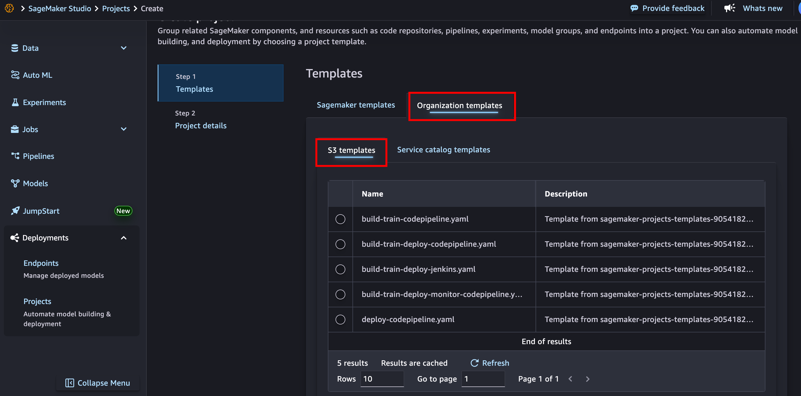
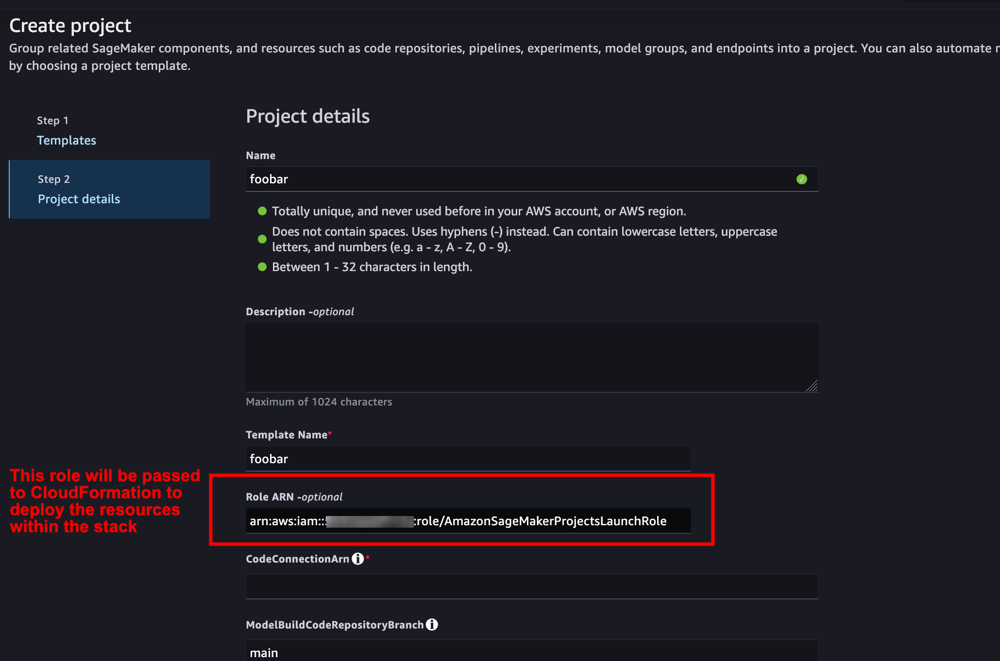

# SageMaker Projects Provided Templates

This folder contains 5 SageMaker project templates that were normally available through AWS Service Catalog in SageMaker AI Studio.
The original templates are provided and supported by the SageMaker Service Team. They can be deployed as custom templates.

## Available Templates

1. **[Model building and training with third-party Git using CodePipeline](./build-train-codepipeline.yaml)** - Basic MLOps template for model training with CodePipeline
2. **[Model building, training, and deployment with third-party Git repositories using CodePipeline](./build-train-deploy-codepipeline.yaml)** - Complete MLOps template for training and deployment with AWS CodePipeline  
3. **[Model building, training, and deployment with third-party Git repositories using Jenkins](./build-train-deploy-jenkins.yaml)** - MLOps template using Jenkins for CI/CD
4. **[Model building, training, deployment and monitoring with third-party git using CodePipeline](./build-train-deploy-monitor-codepipeline.yaml)** - Advanced MLOps template with model monitoring
5. **[Model deployment with third-party Git using CodePipeline](./deploy-codepipeline.yaml)** - Model deployment pipeline template

Detailed information about these templates and how to use them is provided in the [docs](https://docs.aws.amazon.com/sagemaker/latest/dg/sagemaker-projects-templates-sm.html)

## When to Use These Templates

Use these templates when:
- You want to customize the official SageMaker templates
- You need to deploy SageMaker's standard MLOps patterns as custom templates

## Provisioning the templates (only once)

These templates can be deployed using the S3 provisioning model.
Upload the desired template(s) to your S3 bucket and configure your SageMaker domain to use them as custom project templates.

### 1. Upload Templates and Tag for Visibility

Upload your template files to the S3 bucket:

```bash
for file in templates/*.yaml; do
  aws s3 cp "$file" s3://$BUCKET_NAME/templates/ && \
  aws s3api put-object-tagging --bucket $BUCKET_NAME --key "$file" --tagging 'TagSet=[{Key=sagemaker:studio-visibility,Value=true}]'
done
```

Verify the templates are visible in the SageMaker AI Studio console



### 2. Required IAM Roles and Policies

SageMaker Projects use two distinct types of IAM roles to maintain security and separation of concerns:

#### Use Roles

These are service-specific execution roles that AWS services assume to perform their designated tasks within your MLOps pipeline:

- **AmazonSageMakerProjectsCloudformationRole** - Role for CloudFormation to manage SageMaker resources
- **AmazonSageMakerProjectsCodeBuildRole** - Role for CodeBuild projects to build and push container images
- **AmazonSageMakerProjectsCodePipelineRole** - Role for CodePipeline to orchestrate CI/CD workflows
- **AmazonSageMakerProjectsExecutionRole** - Role for SageMaker training and inference jobs
- **AmazonSageMakerProjectsLambdaRole** - Role for Lambda functions used in MLOps workflows
- **AmazonSageMakerProjectsUseRole** - General-purpose role for various SageMaker project services

Each AWS service (CodePipeline, CodeBuild, etc.) assumes its corresponding Use Role to perform only the actions it needs, following the principle of least 
privilege.

#### Launch Role

**AmazonSageMakerProjectsLaunchRole** is a provisioning role that acts as an intermediary during project creation:

- **Purpose**: Contains all permissions needed to create the project's infrastructure (IAM roles, S3 buckets, CodePipeline, etc.)
- **Benefit**: ML engineers and data scientists can create projects without having broader permissions
- **Security**: Their personal SageMaker Execution Role remains limited - they just need permission to assume the Launch Role itself

#### Why This Separation Matters

Without Launch Roles, every ML practitioner would need extensive IAM permissions to create CodePipeline, CodeBuild projects, S3 buckets, and other AWS resources. 
With Launch Roles, they only need permission to assume a pre-configured role that handles the provisioning, keeping their personal permissions minimal and secure.

#### Provision IAM roles and IAM policies

Lets identify the SageMaker Execution role of the SageMaker user profile.
We intend to grant him permissions to deploy the provisioned custom template.

```bash
export SAGEMAKER_EXECUTION_ROLE_ARN=$(aws sagemaker describe-domain --domain-id $DOMAIN_ID --query 'DefaultUserSettings.ExecutionRole' --output text)
```

```bash
aws cloudformation deploy \
  --template-file iam/sagemaker-projects-roles-and-policies.yaml \
  --stack-name sagemaker-projects-roles-policies \
  --capabilities CAPABILITY_NAMED_IAM \
  --parameter-overrides SageMakerExecutionRoleArn=$SAGEMAKER_EXECUTION_ROLE_ARN \
  --region $AWS_REGION
```

This creates the necessary launch and execution roles that SageMaker projects require to provision resources securely.


### 2a. Additional Permissions
**SageMaker Execution Role**

Permission to `iam:PassRole` to **`AmazonSageMakerProjectsLaunchRole`**

```bash
cat > iam/pass-role-policy.json << EOF
{
  "Version": "2012-10-17",
  "Statement": [
    {
      "Effect": "Allow",
      "Action": "iam:PassRole",
      "Resource": "arn:aws:iam::$(aws sts get-caller-identity --query Account --output text):role/AmazonSageMakerProjectsLaunchRole"
    }
  ]
}
EOF
```

```bash
aws iam put-role-policy \
  --role-name $(echo $SAGEMAKER_EXECUTION_ROLE_ARN | cut -d'/' -f3) \
  --policy-name SageMakerProjectsPassRolePolicy \
  --policy-document file://iam/pass-role-policy.json
```

Permission to create CloudFormation Stacks
```bash
aws iam put-role-policy \
  --role-name $(echo $SAGEMAKER_EXECUTION_ROLE_ARN | cut -d'/' -f3) \
  --policy-name SageMakerProjectsCreateCFNTemplates \
  --policy-document file://iam/cfn-stack-sm-projects.json
```
**S3 Tagging (optional)**
The default SageMaker execution role may be missing `s3:GetObjectTagging` permissions required by some templates. Add this permission:

```bash
aws iam put-role-policy \
  --role-name $(echo $SAGEMAKER_EXECUTION_ROLE_ARN | cut -d'/' -f3) \
  --policy-name SageMakerS3GetObjectTaggingPolicy \
  --policy-document file://iam/s3-tagging-policy.json
```

- **[sagemaker-projects-roles-and-policies.yaml](./iam/sagemaker-projects-roles-and-policies.yaml)** - Contains the necessary IAM roles and policies required by these templates
- **[s3-tagging-policy.json](./iam/s3-tagging-policy.json)** - Additional S3 GetObjectTagging policy for SageMaker buckets
- **[cfn-stack-sm-projects.json](./iam/cfn-stack-sm-projects.json)** - CloudFormation permissions policy allowing SageMaker execution role to create and manage CloudFormation stacks for SageMaker AI Projects

## Launch a custom template

### AWS Console (Studio)
1. Open SageMaker Studio
2. Navigate to **Deployments** > **Projects** > **Create project**
3. Choose **Organization templates** > **S3 Templates**
4. Select your template and click **Next**
5. Enter project details - make sure that in the `Role ARN` field, you pass the ARN of the **AmazonSageMakerProjectsLaunchRole**. While the `Role ARN` is not a mandatory field, we reccommend to encapsulate the permission within this role, otherwise you need to extend the SageMaker Execution role itself.

6. Click **Create**.

### Python SDK
```python
import boto3

sagemaker_client = boto3.client('sagemaker', region_name='us-east-1')

response = sagemaker_client.create_project(
    ProjectName='my-custom-project',
    ProjectDescription='SageMaker project with custom CFN template stored in S3',
    TemplateProviders=[{
        'CfnTemplateProvider': {
            'TemplateName': 'CustomProjectTemplate',
            'TemplateURL': f'https://{BUCKET_NAME}.s3.{AWS_REGION}.amazonaws.com/templates/custom-project-template.yml',
            'Parameters': [
                {'Key': 'ParameterKey', 'Value': 'ParameterValue'}
            ]
        }
    }]
)
print(f"Project ARN: {response['ProjectArn']}")
```