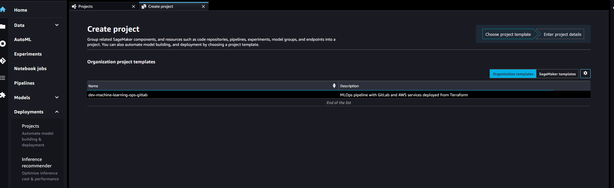

# Amazon SageMaker Project with Terraform and GitLab

This section of the repository contains steps to set up Amazon SageMaker Project with Terraform as infrastructure as code for resources creation and GitLab connection for use case version control.

[A SageMaker Project](https://docs.aws.amazon.com/sagemaker/latest/dg/sagemaker-projects-whatis.html) helps organizations set up and standarize environments for automating different steps involved in a Machine Learning Lifecycle.

While notebooks are helpful for model building and experimentation, a team of data scientists and ML engineers sharing code needs a more scalable way to maintain code consistency and strict version control.

Amazon SageMaker provides a set of first-party templates for organizations that want to quickly get started with ML workflows and CI/CD. The templates include projects that use AWS-native services for CI/CD, such as AWS CodeBuild, AWS CodePipeline etc. For more information about SageMaker-Provided Templates refer to this [link](https://docs.aws.amazon.com/sagemaker/latest/dg/sagemaker-projects-templates-sm.html).

SageMaker Projects can support custom template offerings where organizations use a minimum AWS CloudFormation template to execute a Terraform stack and create the resources needed for an ML workflow.

In this section of this repository we will take a look how we can set up an Amazon SageMaker Project to automate and standardize the different steps involved in a Machine Learning Lifecycle by extending the SageMaker provided templates to provision AWS resources with Terraform and connect the use case code with GitLab repositories.

## Architecture Diagram

 

### Architecture Overview:

* In this example, the ML code will be hosted in a GitLab Repository.
* Everytime a Git Push is performed in this repository, it will trigger a Machine Learning Pipeline orchestrated by the GitLab CI.
* These steps part of the ML workflow will be represented within an Amazon SageMaker feature called as the SageMaker Pipelines.
* SageMaker Pipelines are a series of interconnected steps encoded using a directed acyclic graph (DAG).
* DataScientists can review these SageMaker Pipelines in Amazon SageMaker Studio within the SageMaker Project.
* SageMaker Project also contains other ML workflow components like Experiments, ML repositories, Model Groups, Endpoints etc all in one place for an holistic overview of maintaining a standardized Machine Learning Workflow.

Here are the steps involved in the workflow shown in the Architecture diagram:
1. Platform/Ops team will provision the prerequisites required for setting the SageMaker Custom Template using Terraform.
2. Data Science Lead will create the SageMaker project using this Custom template.
3. Creation of template will trigger another Terraform that will add ML seed code to GitLab.
4. Seed code check in will trigger Build pipeline in GitLabCI. This will launch the SageMaker Pipelines having the ML workflow.
5. Once the SageMaker Pipelines workflow is complete, Model approver can approve the model.
6. This approval will trigger a Deploy Pipeline in GitLabCI.
7. This pipeline will use Terraform to deploy a Stage/Non Prod SageMaker Endpoint.
8. Prod Deployment approver can then review the entire project artifacts & approve the final stage of Deploy pipeline.
9. Once approved, deploy pipeline will trigger Terraform again.
10. Terraform will deploy the SageMaker prod endpoint.

### Repository Overview:
* This repository contains two different packages of Terraform Code:

    * First package is for the [AWS Service Catalog Set Up ](service-catalog-setup)
        - This has the terraform code to provision all the AWS Cloud Infrastructure required to create the SageMaker project.
        - At a high level those resources are:
            - Service Catalog resources.
            - S3 Bucket to store the backend state of the SageMaker Project infrastructure.
            - AWS IAM resources.
            - DynamoDB table for backend state of the SageMaker Project infrastructure. 
            - CloudWatch Log group.
            - Secrets Manager secret to store the GitLab Credentials.
            
    * Second package is for the [Amazon SageMaker Project Set Up](sagemaker-project-setup)
        - This has the terraform code to provision Machine Learning Pipeline resources associated with the SageMaker project.
        - At a high level those resources are:
            - S3 bucket to store the ML artifacts
            - AWS Lambda function to push a sample ML seed code to the GitLab ML repo.

### Integration between Amazon SageMaker Project and Terraform

* To create a SageMaker Project, you have to select a template suited for your ML workflow. It can be a SageMaker provided templates or Custom Templates as explained earlier.
* In this example, we will be selecting a custom template that is provisioned by the first Terraform package as explained in the Repository overview.
* When you create the SageMaker project using this custom template, it will launch a Service Catalog product associated with the template.
* The Service Catalog Product will execute a CloudFormation Stack that launches only a single resource called **Command Runner Utility**.
* This utility provisions an Amazon EC2 instance and runs the Second Terraform package mentioned in the Repository overview section to create the ML pipeline resources required for the SageMaker project.
* **This CloudFormation Stack will not launch any other resources.** It is only used to run a Command Runner Utility to perform the execution of the Terraform code.
* Once the Terraform execution is complete, the CloudFormation Stack status changes to complete and the Amazon EC2 instance launched from the CommandRunner utility is terminated.

## Instructions
    
### Step 1: Enable CloudFormation CommandRunner Utility in your AWS account

1. As mentioned earlier, we will be using CommandRunner Utility to run the second package of the Terraform Code to provision the ML pipeline resources.
2. CommandRunner is not enabled by default, we will need to register it to start using it.
3. Follow the instructions provided [in this link for the CommandRunner set up](https://aws.amazon.com/premiumsupport/knowledge-center/cloudformation-commandrunner-stack/)

### Step 2: Terraform Installation.
1. Install Terraform on your development machine. [Reference Link](https://learn.hashicorp.com/tutorials/terraform/install-cli)

### Step 3: Configure AWS permissions in your development machine.
1. Make sure your development machine has AWS permissions configured to provision the AWS resources using Terraform. [Reference Link](https://docs.aws.amazon.com/cli/latest/userguide/cli-configure-quickstart.html)

### Step 4: Service Catalog Set up.
1. Clone this GitHub repository. __"git clone https://github.com/aws-samples/sagemaker-custom-project-templates.git"__.
2. Navigate to the "Service Catalog Set up" directory. Run __"cd sm-project-tf-gitlab/service-catalog-setup/"__.
3. Update the __"terraform.tfvars"__ file as per your organization environment.
4. Navigate to the "SageMaker Projects Set up" directory. Run __"cd ../sagemaker-project-setup/"__.
5. Update the __"terraform.tfvars"__  and the __"backend.tf"__ files as per your organization environment.
6. Navigate back to the "Service Catalog Set up" directory. Run __"cd ../service-catalog-setup/"__.
7. Initialize Terraform. Run __"terraform init"__.
8. Generate the Terraform plan. Run __"terraform plan"__.
9. Execute the Terraform code. Run __"terraform apply"__.
10. This terraform execution will return the follow outputs. Make a note of these outputs.
    - IAM Instance Profile for the CommandRunner Utility.
    - S3 Bucket Name.
    - Secrets Manager Secrets which has the GitLab token, credentials and IAM access keys. 
    - Service Catalog Product Name.
    - CloudWatch Log Group Name.
11. Last step before moving on to create the SageMaker project, make sure "AmazonSageMakerServiceCatalogProductsUseRole" IAM role has read access to the above generated Secret Manager Secrets.
 
### Step 5: Create the Amazon SageMaker Project inside the SageMaker Studio.

1. Open SageMaker Studio and sign in to your user profile. Make sure the SageMaker Exec IAM role mapped to the User profile has access to the Service Catalog.
2. Choose the SageMaker __Deployments__ icon on the left, and choose the __Projects__ option.
3. The default view displays SageMaker templates. Switch to the __Organization__ templates tab to see custom project templates.
4. Look for the template with the Service Catalog Product Name you noted from the outputs of the previous Terraform execution step.

    
    
5. Choose the template and click Select project template.
6. Enter a name and optional description for the project. 

    

7. We now need to enter the values for the Project Template parameters. They are populated with the default values, but needs to be updated as per your environment.
8. For CommandRunnerIAMInstanceProfile, enter the value of "command_runner_instance_profile" you had noted from the Output of Terraform Run of previous step.
9. For TerraformInitAction, select "init". 
10. For TerraformAction - select "apply".
11. For SecretsManagerGitlabPrivateToken, enter the "secrets_manager_gitlab_private_token" noted from the Output of Terraform Run of previous step.
12. For MLOpsS3Bucket, enter the value of "s3_bucket_id" you had noted from the Output of Terraform Run of previous step.
13. For GitBuildRepoName, enter the GitLab Project Name where you will have the ML Build Code. Please make sure this is a new project name.
14. For GitRepoURL, enter the URL of your GitLab repository (For ex: https://gitlab.com).
15. For SecretsManagerGitlabIAMSecretKey, enter the value of "secrets_manager_gitlab_iam_secret_key" you had noted from the Output of Terraform Run of previous step.
16. For CommandRunerCWLogGrp, enter the value of "cw_log_group_name" you had noted from the Output of Terraform Run of previous step.
17. For GitDeployRepoName, enter the GitLab Project Name where you will have the ML Deploy Code. Please make sure this is a new project name.
18. For SecretsManagerGitlabUserSecretARN, enter the value of "secrets_manager_gitlab_user_creds" you had noted from the Output of Terraform Run of previous step.
19. For SecretsManagerGitlabIAMAccessKey, enter the value of "secrets_manager_gitlab_iam_access_key" you had noted from the Output of Terraform Run of previous step.
20. Select Create Project.
21. This will trigger the CloudFormation CommandRunner Utility which will inturn perform the Terraform execution to provision the SageMaker Pipeline resources.
22. The logs of this terraform run will be available in the CloudWatch Log Group you noted from the Output of Terraform Run of previous step.
23. You have now successfully created an MLOps SageMaker Project with Terraform integration and GitLab. 

### Step 7: Cleanup (Optional)

1. To cleanup the SageMaker Project resources, choose Update from the Actions menu in the upper-right corner of the project tab.

    

2. Change TerraformAction parameter to "destroy".
3. Update the SageMaker Project.
4. Monitor the logs in CloudWatch Log group for completion of Terraform run.
5. Once it is complete, right click on the SageMaker Project and select "Delete Project" to delete the SageMaker Project.
6. Now go back to the development machine where you had cloned this repo.
7. Navigate back to the "Service Catalog Set up" directory. Run __"cd sm-project-tf-gitlab/service-catalog-setup/"__.
8. Generate the Terraform plan. Run __"terraform plan"__.
9. Execute the Terraform Destroy. Run __"terraform destroy"__.